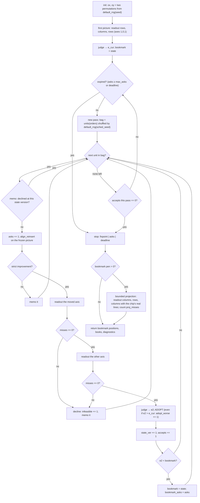
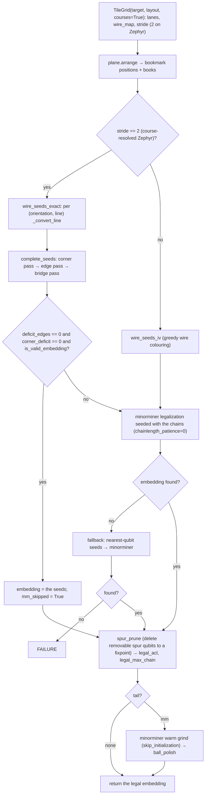

# The plane embedder — algorithm hand-off

Branch `factored`, state s3.127 (2026-09). This file explains the
algorithm in `packages/ember-qc/src/ember_qc/algorithms/factored/`
from first principles for someone who has never seen the code. Every
claim below was checked against the source or by running it; where a
number is quoted it comes from `docs/paper2/notes.md` s3.127 or from
`docs/paper2/fabrics.md`. Code map:

| file | role | size |
|---|---|---|
| `plane.py` | the engine: state, packer readout, judge, units, loop | 463 lines |
| `field.py` | the fabric adapter and the exact kernels (stair contacts, books, packer DP, interleaver DP, converter, completion) | 1901 lines |
| `placement.py` | the pipeline: `attract_embed(source, target, *, timeout, seed, max_asks, sched_seed, tail)` | 292 lines |
| `polish.py`, `ball.py`, `trees.py` | spur pruning; the optional ball-polish tail | — |

Other reading: `docs/paper2/ideas.md` (one-page spec), `anatomy.md`
(as-built), `fabrics.md` (measured hardware facts), `mm-internals.md`
(what shipped minorminer does), `notes.md` s3.127 (the rewrite's
audit, the boards, the invariance map).

---

## 1. The problem

**Minor embedding.** Given a source graph G (the problem) and a target
graph H (the annealer's qubit graph), find for every source vertex v a
*chain* φ(v) ⊆ V(H) such that (i) each chain induces a connected
subgraph of H, (ii) chains are pairwise disjoint, (iii) for every
source edge (u, v) there is at least one coupler of H between φ(u) and
φ(v). Every extra qubit in a chain costs annealing fidelity, so the
quantities reported are

- **ACL** — average chain length, Σ_v |φ(v)| / |V(G)|;
- **max chain** — max_v |φ(v)|.

Validity is checked by `is_valid_embedding` (connected, disjoint, edges
covered) in `ember_qc.embedding_backend`.

**Why minorminer is the baseline.** minorminer (Cai, Macready, Roy 2014;
the shipped program is 0.2.22) is the tool D-Wave ships and the one
every paper compares against. It knows nothing about the geometry of
the fabric: it grows chains one variable at a time by shortest paths
through H, prices qubit overlap so hard that any occupancy level
dominates any path length, restarts on failure, and then shortens
chains. Its results on dense graphs are far from the constructive
templates (K100 on Zephyr Z12: minorminer 10.47 ACL, the clique
template 7.26; K_{81,81}: 11.30 vs the 6.000 template). The engine
here is built to reach template quality from random starts on the
fabrics that have a lane geometry, and to hand minorminer a legal
embedding only as an optional polish.

---

## 2. The geometric insight: lanes, junctions, bars, crossings

A D-Wave fabric is not a generic graph. In every family a qubit is a
**bar** — a horizontal or vertical segment on a **lane** — and the
hardware graph is the intersection graph of those bars. Measured on
the actual `dwave_networkx` graphs (`fabrics.md`):

| family | wires per line | bar spans | junction | complete? |
|---|---|---|---|---|
| Chimera C_m (t=4) | 4 | 1 cell | K_{4,4} | yes (16/16) |
| Pegasus P_m | 12 | 3 cells | ~56% of crossings coupled | **no** — parked |
| Zephyr Z_m (t=4) | 8 sub-lanes (4 tracks × 2 courses) | 2 junctions | K_{8,8} | yes (64/64) |

Three coupler species: **internal** (an h-bar crosses a v-bar),
**external** (two collinear bars abut end to end — these build straight
lanes), **odd** (two parallel bars in the same neighbourhood; the
constructive templates use none of them).

**A junction** (Zephyr): a horizontal line (row) of 8 sub-lanes meets a
vertical line (column) of 8 sub-lanes; all 64 crossings are couplers.

```
                 column c (8 vertical sub-lanes)
                 | | | | | | | |
      row r  ====+=+=+=+=+=+=+=+====   h sub-lane 0
             ====+=+=+=+=+=+=+=+====   h sub-lane 1
             ====+=+=+=+=+=+=+=+====      ...
             ====+=+=+=+=+=+=+=+====   h sub-lane 7
                 | | | | | | | |
      every "+" is a coupler: the junction is K_{8,8}
```

**A chain is a horizontal run plus a vertical run** that meet at one
junction (their corner, an internal coupler). **A source edge is a
crossing**: one variable's horizontal run passes the junction where the
other's vertical run is, on a complete junction that crossing *is* a
coupler.

```
                       col x_u
                         |
                         |   <- u's vertical run
       row y_v  ---------X-------------   <- v's horizontal run
                         |
                         |
        X = junction (x_u, y_v): v's h-run crosses u's v-run,
            so the edge (u, v) is realized by one internal coupler.
```

**The clique template ("the crystal").** Put the n variables of K_n on
a diagonal, variable i at column i, row i, and let each variable's
h-run reach the columns of all variables above it and its v-run reach
the rows of all variables below it. Every pair (i < j) crosses exactly
once, at (column j, row i). Each chain is an L whose two arms sum to a
constant (this is busclique's `inflate_first_ell` staircase).

```
        row 3                            [3]         3: no h-run; v-run down col 3
                                          |
        row 2                    [2]------X          2: h-run cols 2..3; v-run down col 2
                                  |       |
        row 1            [1]------X-------X          1: h-run cols 1..3; v-run down col 1
                          |       |       |
        row 0    [0]------X-------X-------X          0: h-run cols 0..3; no v-run
                 col 0   col 1   col 2   col 3
        every X above the diagonal = one edge of K_4, at (col j, row i) for i < j
```

**The biclique template ("turán").** For K_{a,b} put block A entirely
below block B in the row order. Every A variable's h-run reaches all
of B's columns; every B variable's v-run reaches all of A's rows; A's
v-runs and B's h-runs have nothing to reach and do not exist. Every
chain is a **single straight run**, and a straight run of L Zephyr
bars meets 16L distinct opposite sub-lanes, so K_{81,81} needs
⌈81/16⌉ = 6 bars per chain: ACL 6.000, which the engine reaches
(Section 10).

```
                 B1  B2  B3  B4  ...      (B: vertical runs, 8 per column)
                  |   |   |   |
        A1   -----X---X---X---X-----      (A: horizontal runs, 8 per row)
        A2   -----X---X---X---X-----
        A3   -----X---X---X---X-----
                  |   |   |   |
        every crossing is an edge; no corners, no L's
```

**Courses, bricks, parity on Zephyr.** A Zephyr qubit has coordinates
(u, w, k, j, z): orientation u, line w ∈ 0..2m, track k ∈ 0..3,
course j ∈ {0,1}, position z. Its position along the line is
p = 2z + j, and the bar covers junction lines {p, p+1}. Along one
track the j=0 bars tile the line end to end and the j=1 bars do the
same shifted by one junction — a running-bond brick wall — so a line
carries 8 straight sub-lanes, indexed `sub = 2k + j` in the adapter
(`_tile_orient`, `courses=True`). A sub-lane's bars sit at positions
p ≡ j (mod 2). Capacity is counted per **brick** = position pair
{2b, 2b+1}: exactly 8 bars start in every interior brick (4 even-course
at 2b, 4 odd-course at 2b+1), so the per-(line, brick) pool is 8
(`_brick_pool_arrays`; `stride = 2` is the brick period).

```
   junction lines:   0     1     2     3     4     5     6
   course j=0:      [=====][=====][=====]           p = 0, 2, 4
   course j=1:            [=====][=====][=====]     p = 1, 3, 5
   brick b:          |  0  |  1  |  2  |  phantom
   line 0 is covered only by the p=0 bar (course 0);
   line 6 (= 2m) only by the p=5 bar (course 1).
```

**Why boundary lines have zero pool.** Line 0 is covered only by
even-course bars, line 2m only by odd-course bars: each boundary line
sees 4 crossing sub-lanes per side, not 8, and a parity-blind claim
onto it produces structurally uncoverable crossings (`fabrics.md`
4.3b). The engine therefore sets the pools of the two boundary lines
of each orientation to zero on course fabrics (`plane.profiles`,
`stride > 1`); a Z3 row-profile table is

```
   row 0:  0 0 0 0      <- boundary
   row 1:  8 8 8 0      <- last column is the phantom brick
   ...
   row 5:  8 8 8 0
   row 6:  0 0 0 0      <- boundary
```

---

## 3. The state: two orders

The engine stores exactly two permutations of the variables: the
**x-order** `ox` (left to right) and the **y-order** `oy` (bottom to
top). Nothing else. Positions and chains are *derived*:

1. **Positions** `pos[v] = (column line, row line)` are produced by
   the packer (Section 4) from the orders — an assignment of each
   order to lines that is monotone in the order and respects capacity.
2. **Contacts** come from the **stair rule** (`_stair_contacts` with
   `yrank`): for every source edge (u, v), the endpoint that is *lower
   in the y-order* reaches **sideways** to the other's column, and the
   endpoint *higher* in the y-order reaches **down** to the other's
   row. Formally, if yrank(v) < yrank(u): u ∈ h_us(v) and v ∈ v_us(u).
   The crossing is at (x_u, y_v).
3. **Arms** are hulls (`_bars_arrays` / `arm_books`): the h-arm of v
   spans columns [min, max] of {x_v} ∪ {x_u : u ∈ h_us(v)}; the v-arm
   spans rows [min, max] of {y_v} ∪ {y_u : u ∈ v_us(v)}. An arm with
   no contacts is *inactive* (a point; its one-tile footprint is still
   booked). Chains are never stored: they are recomputed from the
   orders whenever needed.

Why that suffices: the stair rule is an order statistic of the y-order
only, so the contact structure is invariant under any order-preserving
change of positions; the packer's assignment is order-preserving by
construction; and on a complete junction "my run crosses your run" is
already "we are coupled". Two orders determine a valid crossing
pattern for every edge; the packer only decides how far apart the
lines are.

**Worked example** (5 variables, edges 0-1, 0-2, 1-2, 1-3, 2-4, 3-4;
x-order [2,0,3,1,4], y-order [0,1,2,3,4]; positions = ranks):

```
   contacts (h_us, v_us):   0:([1,2],[])   1:([2,3],[0])   2:([4],[0,1])
                            3:([4],[1])    4:([],[2,3])

              x=0       x=1       x=2       x=3       x=4
   y=4         .         .         .         .        [4]      4: v-arm rows 2..4
                                                       |
   y=3         .         .        [3]------------------X       3: h cols 2..4, v rows 1..3
                                   |                   |
   y=2        [2]------------------+-------------------X       2: h cols 0..4, v rows 0..2
               |                   |
   y=1         X-------------------X--------[1]                1: h cols 0..3, v rows 0..1
               |                             |
   y=0         X--------[0]------------------X                 0: h cols 0..3, no v-arm

   X = a crossing that realizes an edge: (3,0) 0-1, (0,0) 0-2, (0,1) 1-2,
       (2,1) 1-3, (4,2) 2-4, (4,3) 3-4.   + = a crossing of no edge (2's h-arm
       over 3's v-arm): harmless, the coupler is just unused.
```

Spans: h 3+3+4+2+0 = 12, v 0+1+2+2+2 = 7; eight arms are active.
`stair_energy(bar=0)` = 19, `stair_energy(bar=2)` = 35 (Section 5).

---

## 4. The packer: orders → lines (`pack_lines`, `_pack_dp`, `_jstar_profile`)

`readout(axis, …)` in `plane.py` turns one order into line indices on
that axis, holding the other axis fixed. It runs one **forced pack**
(`pack_axis`) and rewrites the positions as integer line indices.

**The model.** Items are the variables in the carried order
(1 … n). Lines are l = 0 … L−1. Each line receives a **contiguous
run** of the order (possibly empty); the assignment is non-decreasing
in the order by construction. Packing **rows** (axis 1): each row's
run is feasible iff the *h-arm claim intervals* of its variables fit
the row's per-brick pools; packing **columns** (axis 0): the v-arm
intervals against the column's pools. A claim interval is the arm's
inclusive hull [a, b] (with snap widening, Section 9) and covers
bricks ⌊a/s⌋ … ⌊b/s⌋; a run fits iff at every brick the number of
covering intervals ≤ pool. `_jstar_profile` computes, for each i, the
smallest j such that items j … i−1 fit a given profile (two pointers
over a lazy segment tree whose leaves start at −pool[b], so "fits" is
"root ≤ 0"). Lines with pool 0 everywhere (the boundary lines) can
start no run (`capidx = −1`): the DP can only carry past them.

**The cost is the true stair objective, linearized.** Given the
orders, the y-part of the stair energy is Σ over v-nets
({v} ∪ v_us(v)) of (row of the net's order-max member − row of its
order-min member) — exactly the v-arm spans. That is linear in the
row assignment: E_y = Σ_v c_v · row(v) with

    c_v = (#nets v tops) − (#nets v bottoms)          (`_axis_coeffs`)

where "top/bottom" is by the *carried order's rank*, so the formula is
exact for **any** assignment monotone in the order — which is what the
pack produces. Columns likewise with the h-nets {v} ∪ h_us(v). In the
Section 3 example the row coefficients are {0:−2, 1:0, 2:0, 3:+1,
4:+1}: −2·0 + 3 + 4 = 7 = the v-span total.

**The DP** (`_pack_dp`): f_l(i) = min cost of the first i items on
lines ≤ l.

    f_l(i) = min( f_{l−1}(i)                                  carry
                , min_{j ≥ js_l(i)} f_{l−1}(j) + Σ_{k=j}^{i−1} c_k·l   run j..i−1 on l
                , f_l(i−1) + MISS )                           skip

MISS = 1e6 dominates any real cost, so a skip is used only when the
item is structurally unplaceable; a skip inside a run ends that run.
The run minimum is a sliding-window minimum (monotone deque) over j,
so the whole DP is O(n·L) after the feasibility passes. Backtracking
returns `assign[k]` = line or `None`. In `pack_axis` a `None` item is
placed on its order-predecessor's line (monotone by construction) and
**counted** as a miss.

**Mini-example** (brick = 1 junction, pool 2 on every line, 6 items in
order with intervals and coefficients):

```
   item:      0      1      2      3      4      5
   hull:    [0,2]  [1,3]  [2,4]  [0,1]  [3,5]  [4,6]
   coeff:    −2     −1      0      0     +1     +2

   pack_lines → assign [0, 0, 1, 1, 1, 2], cost 5
     line 0: [0,2] [1,3]              depth 2 ≤ 2
     line 1: [2,4] [0,1] [3,5]        depth 2 ≤ 2 ([2,4] and [3,5] share brick 3..4)
     line 2: [4,6]                    item 5 cannot join line 1: brick 4 would hold 3
   cost = (−2)·0 + (−1)·0 + 0·1 + 0·1 + 1·1 + 2·2 = 5.
   With pool 1 the answer is [0,1,2,2,3,4] (cost 10); with two lines of
   pool 2 and six identical hulls [0,3] the first two items are skipped
   (assign [None, None, 0, 0, 1, 1], cost 2·10^6).
```

**The line table during the search** (`_line_profiles`, unbounded):
the chip's real lines, each truncated at its last capacity-bearing
brick and then extended past the chip with the **ideal pool** (the
largest line pool, 8 on Zephyr) up to the farthest hull, plus enough
extra lines shaped like an interior line to seat everyone at full pool
(⌈n/pool⌉ + 1 of them). Both axes. Consequence: every order has a
packing and nothing is clamped; what hangs off the chip is priced by
the judge, not hidden. This was forced by measurement: with the chip's
real lines only, a random start on regular/ws could not be packed into
the 23 usable columns, every proposal was declined, and the engine
made zero accepts (notes s3.127, "the strip was wrong as a start
condition").

**The bounded projection at the end.** If the bookmark still hangs off
the chip (pen > 0), `arrange` re-packs it with `bounded=True` — the
chip's real lines and bricks only — on axes (0, 1, 0): columns first
(while x hangs off the chip, h-arms past the last real brick are free
in a row pack, and packing rows first stacked everyone on one row),
then rows, then columns again. Stragglers take their predecessor's
line and are counted (`proj_misses`); the router legalizes them. The
search's own (pen, stair) stays reported.

---

## 5. The judge (`plane.judge`)

The objective is the pair **(pen, stair)**, compared lexicographically
as a Python tuple. Both are integers (stair is an integer-valued
float). There is no weight and no λ.

- **pen** (overload): for every (orientation, line, brick), the claim
  intervals of the books are swept into a coverage count; pool is read
  from `profiles(grid)` (boundary lines 0), and **lines or bricks the
  chip does not have are pool 0** — a state that hangs off the chip is
  priced, never clamped. pen = Σ max(cover − pool, 0)². The brick rule
  is the packer's own (`_cover_bricks`), so packer and judge agree.
- **stair** (`stair_energy(bar=stride)`): Σ over variables of
  (h-hull span + v-hull span) **plus `bar` = stride junctions for every
  active arm** (an arm with ≥ 1 contact). In the Section 3 example:
  spans 19, eight active arms × 2 = 16, stair = 35; and because
  variable 0 sits on row 0 and variable 2 on column 0 (boundary lines,
  pool 0, two bricks each), pen = 4.

**Why the bar term.** An arm whose hull is a single junction still
needs a real qubit — the converter must seat the crossing. Pricing a
point arm at 0 undercounted the realized qubit mass by **−76 % on
grid_200 and −68 % on ws**; with the bar term the prediction is within
−1 % to −8 % (notes s3.127, deviation 5). It also changes *which*
layouts win: on turán the crystal has **162 active arms** (one per
variable) versus **322** for the maximally interleaved layout the old
engine was stuck in; a span-only judge cannot see that difference.
In the notes' words, "the judge itself preferred the crystal all
along (1768 vs 2598 vs 3906 at the init): turán was reachability +
budget."

---

## 6. The move: the interleaver DP (`align_reinsert`)

One move type. Take a set S of variables (the *unit*) out of one
order; call the remainder R (both keep their internal order). Re-weave
S into R at the **exact optimum over all merges** — every sequence
whose subsequences are R and S — trying S forward and S reversed, and
return the best weave iff it **strictly** improves the objective; else
decline (`(None, False)`).

**A merge is a lattice path.** With p = |R|, m = |S|, a merge is a
monotone path from (0,0) to (p,m) in which an R-step places the next
R member and a Q-step the next S member. The DP fills T[i][j] =
min(T[i−1][j] + a[i][j], T[i][j−1] + b[i][j]) — implemented one row
at a time with a running minimum — and backtracks (ties prefer the
R-step, so the merge is deterministic).

```
   R = [2, 0, 3, 1]   S = [4]            (x-axis, the Section 3 example)

              j=0        j=1             a Q-step (→) places the next S member,
     i=0       o ======> o               an R-step (↓) the next R member
               |         ‖
     i=1       o         o   place 2
               |         ‖
     i=2       o         o   place 0
               |         ‖
     i=3       o         o   place 3
               |         ‖
     i=4       o         o   place 1     (p, m) = (4, 1)

   the chosen path (double line): Q-step first, then four R-steps
   → [4, 2, 0, 3, 1]; true cost 35 → 33 (the h-nets {2,4} and {3,4}
   shrink from spans 4 + 2 to 1 + 3; every other net keeps its span).
   The left column is the identity path [2, 0, 3, 1, 4] (cost e0).
```

**The frozen picture.** The *spots* on the moved axis are fixed: the
k-th member of the new order takes the k-th old value (`vals`). The
*other axis* is fixed (`other`). Occupants move; nothing is re-packed
inside the DP. So the DP prices exactly what the state would cost if
the readout changed nothing — the readout then re-packs (Section 8).

**Pricing on the x-axis (axis 0).** The y-order is untouched, so
contacts are exactly frozen. The h-net of w is {w} ∪ h_us(w); its span
is Σ over slot gaps of (gap × [some member placed and some not]). The
count of open nets at each DP cell is a function of the placed set
(R's first i, S's first j) — computed by rectangle scatter + 2-D
prefix sum (`CG`). The v-term is a constant and omitted; the bar term
is constant too.

**Pricing on the y-axis (axis 1): the induced rule.** The stair rule
is an order statistic of the y-order, and the DP builds the y-order
bottom-up, so contacts are re-derived per candidate rather than read
stale: "placed after = above". When v is placed, its h-net is {v} ∪
its not-yet-placed neighbours, whose x-values are static this move —
its h-span is paid at the transition (`stepR`/`stepQ`). Its v-arm
crosses a slot gap iff v is unplaced while ≥ 1 neighbour is already
placed — again a function of the placed set (`CG`). The bar is priced
in the same transitions: h-arm active iff some neighbour is still
unplaced, v-arm active iff some neighbour is already placed.

**The exact lexicographic tiebreak.** All true-cost quantities (slot
values, other-axis values, the bar) are multiplied by
`rank_scale(n) = 2n²+1`, and the slot *index* is added to each slot
value, so a gap between consecutive slots is (true gap)·scale + 1.
The DP then minimizes `true_cost × (2n²+1) + total rank span`; since
≤ 2n arms each span < n slots, a rank-span difference can never
outweigh one unit of true cost. The move is accepted iff this number
strictly beats the identity path's (`e0`). **Why ties matter:** the
old engine's 1e-4 ramp was this same tiebreak but at n = 486 its
weight reached ~20 true units (a second objective); removing it
outright stalled sparse graphs on plateaus — **path-60 went from 1.017
to 1.5** — because the tie-moves are the drift that compacts a chain.
The exact form restores 1.017 on the old engine (the new engine's
fingerprint is 1.033).

**Memo.** A (unit, axis) the DP declined at the current state version
is not asked again until some move is accepted (`tried[key] ==
state_ver`).

In the Section 3 example the y-axis move with S = {4} returns
[0, 1, 4, 2, 3] (true cost 35 → 29): 4 moves below its neighbours 2
and 3, so 4 now reaches sideways once and 2, 3 reach down to it.

---

## 7. Units: what gets asked

`plane.units` builds one pass's questions. On **each axis**:

1. every **contiguous run** of the current order at scales
   n/2, n/4, …, 2 (half-overlapping: step = scale/2) and every
   singleton (scale 1, step 1). For n = 8: (0..3), (2..5), (4..7),
   (6,7); then all pairs of adjacent slots; then singletons.
2. every variable's **neighbourhood N(v)** (excluding v; only if
   1 ≤ |N(v)| < n), as one block — the *order-independent gather*.

The whole list is shuffled once per pass with `default_rng(sched_seed)`.
For n = 5 there are 30 units per pass; for n = 8 (a cycle) 56.

**Why N(v).** A reinsert keeps both R and S as subsequences. If the two
blocks of a biclique are interleaved in the y-order, then every
contiguous run is a mix and its complement is a mix, and after the
merge both mixes persist: **contiguous runs cannot un-interleave**.
The one unit that gathers a scattered block is N(v) — for a biclique
it is exactly the other block, so the bipartition of Section 2 is
**one move** (measured on K_{81,81}: one ask, stair 5219 → 3134). For
a sparse graph N(v) is "bring my neighbours to me". This is the second
of the two defects that kept the old engine at 9.253 on turán.

**Why no edge pairs.** The old engine's pass was 93 % edge-pair asks
(938 interval asks + 13,122 pair asks); the bookmark sat at ask 726
and 12,700 pair asks improved nothing. They are gone.

---

## 8. The loop (`plane.arrange`)



Points that the flowchart compresses:

- **Bag schedule.** One shuffled bag per pass; `sched_seed` defaults to
  `seed` and is varied independently by the invariance instrument.
- **Accept-all with the bookmark.** Every proposal the packer can seat
  is adopted, including ones the judge scores worse than the current
  state (the proposer priced the frozen picture; the readout may move
  things). The bookmark keeps the best (pen, stair) ever judged and is
  what `arrange` returns. `adopt_worse` counts the worse adoptions.
- **Readout re-packs the moved axis, then the other.** The packer's
  guarantee is capacity on both axes: the moved axis's contacts
  changed, and the other axis's hulls changed with them. Re-packing
  only the moved axis left the other axis overloaded until its next
  accepted move; accept-all then wandered in overloaded states — on
  turán the bookmark stayed frozen at the init for 15,000 asks on 3/10
  seeds. Two packs per adoption is the fix, and the reason an ask is
  ~5× the old engine's.
- **Decline on unpackable.** If either pack reports a miss the
  proposal is outside the valid set and is declined (memoized), never
  adopted with a priced overload. Measured: adopting one such state on
  turán left the bookmark at the init for 15,000 asks.
- **Stops.** A pass with zero accepts is the **fixpoint** certificate
  (every unit on both axes was asked at the final state and none
  improved). `max_asks` counts DP evaluations — the work budget the
  boards use, so results do not depend on the machine's load. The
  `deadline` is a safety net and is reported as `stopped_by =
  "deadline"` when it fires.
- **Trivial cases.** n < 3 or an untyped target: the engine returns
  rank positions and the router does the work (`stopped_by =
  "trivial"`).

Diagnostics returned: `asks`, `accepts`, `passes`, `readouts`,
`bookmark_asks`, `bookmark_wall`, `stopped_by`, `pen`, `stair`, `bars`
(active arms in the bookmark; n means every variable is one-sided),
`misses`, `adopt_worse`, `infeasible`, `accept_traj` (accepts per
pass), `projected`, `proj_misses`, `orders`, `yrank`, `wall`.

---

## 9. The adapter: books → qubits (`placement.attract_embed`)



**Books** (`arm_books(floor=False, min_span=0, snap, ybound=False)`)
are the one accounting shared by packer, judge and converter: the
contacts, the hulls, and per orientation the claim tuples
`(line, a, b, v)`. On Zephyr `snap=True` widens each claim to
[c_min − 1, c_max] over the arm's contact lines (own line included),
because a bar on either course that covers junction line c starts at
c or c−1; `min_span=0` makes an arm with no contacts still occupy one
tile. No capacity floor from a degree heuristic: capacity is the
derived reach, enforced by the packer.

**The converter** (`_convert_line`, one line at a time; targets from
`_arm_targets` = the arm's contact lines plus its own corner):

1. *Parity classes.* The line's sub-lanes split by course parity
   (`sub % 2`), 4 lanes each on an interior Zephyr line. For an arm
   with targets C and parity π, the **required hull** is the span of
   the parity-snapped targets {c if c ≡ π else c−1}. Only the required
   hull is claimed — not the wider books interval — so benign overlap
   of the books' hulls does not block seating.
2. *Class assignment.* An exact DP over arms sorted by earliest
   required start, state = the set of (arm, class) still active; any
   feasible line keeps ≤ 8 arms alive, so the state space is tiny.
   Cost = total required-hull length (shorter claims win ties).
3. *Lane seating.* Per class, left-endpoint order over required
   hulls; a lane is usable iff its qubits at every position of the
   hull exist (dead qubits are lane-infeasibility), are unclaimed, and
   are consecutive at the stride. An arm that cannot be seated falls
   back to its books interval on any lane, and is counted
   (`convert_miss`). `_ensure_seeds` then gives any empty chain its
   nearest free qubit.

**Completion** (`complete_seeds`; on a complete junction fabric
validity = coverage, so the closure is interval arithmetic along
wires through free bars only):

1. *Corner*: connect each variable's own h-run and v-run — cheapest
   pair of extensions to a crossing; failure counts `corner_deficit`.
2. *Edge*: for each uncovered source edge (sorted, live re-check), the
   cheapest feasible perpendicular extension among both crossings and
   both sides. For an h-run on sub-lane s to reach column c the target
   position is p* = c if c and s share parity else c−1 (an exact iff
   verified over all Z12 cross-orientation couplers).
3. *Bridge*: 1- then 2-free-qubit bridges for the residue; the rest is
   `deficit_edges`.

**The certificate.** `deficit_edges == 0 and corner_deficit == 0` and a
passing `is_valid_embedding` ⇒ the seeds *are* the embedding and
minorminer is skipped (`mm_skipped`). `certified` in the diagnostics
additionally requires `convert_miss == 0` (every arm seated its
required hull). Otherwise minorminer legalizes from the seeds, then a
nearest-qubit-seeded fallback. On Pegasus (junctions ~56 % complete)
the exactness path is gated off (`stride == 1`): the engine runs, the
seeds go to minorminer.

**Wall budget.** With a `timeout` and `tail="mm"`, the engine plus
legalization get the first half (`TAIL_SPLIT = 0.5`), the tail the
rest. The engine's real stop is `max_asks` or its fixpoint.

**Result dict:** `embedding`, `time`, `stair_E`, `legal_acl` (pre-tail),
`diag` (the engine's diagnostics plus `legal_max_chain`, `certified`,
`mm_skipped`, `convert_miss` and the completion counters).

---

## 10. What the measurements say (notes s3.127)

All on Zephyr Z12 (`dnx.zephyr_graph(12, 4)`), harnesses in
`docs/paper2/data/`. Cells: K100, K140 (cliques); ER100_d10
(G(100, 10/99), seed 12345); turán = K_{81,81} (n 162, graph id 2647);
spin_glass n163 (degrees 34–64); regular n316 (4-regular); ws n486
(degrees 2–7); grid_200 (n 200, m 370); honeycomb_200 (3-regular);
king_graph_196 (degrees 3–8). Work budgets (`max_asks`): K100 10k,
K140 12k, ER 8k, turán 15k, spin_glass 12k, regular 10k, ws 15k,
grid/honeycomb/king 8k.

**Checkpoints** (`plane_fingerprint.py`, `tail="none"`, work budgets;
`plane_fingerprint_step0-old.json` = the old engine from a random
init, `step4-plane2.json` = the rewrite as first built):

| cell | old engine (random init) | new engine |
|---|---|---|
| K8 / K10 on Z3 | 1.5 / 1.8 certified | 1.5 / 1.8 certified |
| path-60 | 1.017 | 1.033 |
| K100 | 7.26 (budget-bound at 10k asks) | 7.26 at a FIXPOINT, 1,370 asks |
| turán n162, seeds 0–9 | 6.000 on 3/10 | **6.000 on 10/10** (bookmark 1.9k–14.8k asks) |
| grid_200 pre-tail | 1.87 | **1.40** (old polished: 1.33) |

All certified, minorminer skipped, extensions 0. **Caveat, verified
against the JSON files:** the step-4 numbers predate the both-axes
strip fix of Section 4. The shipped default
(`plane_fingerprint_step5-default.json`, seed 0) measures grid_200
**1.605** (max chain 6, stopped by asks) and path-60 **1.067**
(fixpoint); K100 and turán are unchanged. ideas.md still quotes the
step-4 figures (1.40, 1.033).

**Paired board** (`rewrite_board.py`; mm = stock minorminer 60 s; old
= the archived default engine (worktree `ea5d1cf2`) 60 s with its
tail; new = the rewrite at a work budget, tail none; new+mm = the
rewrite with the tail at 60 s wall; deep cells 10 seeds, others 3;
ACL / mean max chain):

| cell | mm | old (+tail) | new (no tail) | new+mm |
|---|---|---|---|---|
| K100 | 10.47 / 15 | 7.26 / 8 | 7.26 / 8 | 7.26 / 8 |
| K140 | 20.29 / 40 (2/3) | 9.76 / 10 | 9.77 / 10.7 | 9.77 / 10.7 |
| spin_glass | 20.56 / 35 | 11.04 / 12.7 | 10.85 / 12.3 | 10.84 / 12 |
| turán | 11.30 / 18.9 | 9.46 / 12.5 | **6.000 / 6** | **6.000 / 6** |
| ER100 | 4.82 / 8.8 | 4.65 / 7.8 | 4.60 / 8.1 | **4.45 / 7.5** |
| regular | 3.59 / 9.6 | **2.78 / 6.5** | 4.75 / 13.6 | 3.61 / 9.3 |
| ws | 3.14 / 11.7 | **2.56 / 8.0** | 4.40 / 27.4 | 3.34 / 12.1 |
| grid | 1.08 / 2 | 1.27 / 3 | 1.59 / 5.7 | 1.29 / 2.7 |
| honeycomb | 1.16 / 2.3 | 1.33 / 2.7 | 1.89 / 6 | 1.24 / 2.7 |
| king | 1.76 / 3.7 | 1.83 / 4 | 2.56 / 7.7 | 2.11 / 4.7 |

Reading it honestly:

- **Dense and ER: the rewrite wins outright.** Every dense cell is at
  the template; turán is exact on 10/10 random inits (old 9.46,
  minorminer 11.30); ER with the tail is the best ever recorded
  (4.45).
- **Sparse: the rewrite loses to the old engine** with the tail on
  regular (+0.83), ws (+0.78) and king (+0.28), ties on grid, wins on
  honeycomb; without the tail its numbers are clearly worse
  (ws 4.40 with max chain 27). Two measured causes: (a) **per-ask
  cost** — a new-engine ask is ~5× an old one (two packs + two books
  per adoption, the N(v) units, the interleaver's `stepR` Python
  loop), so in the 30 s wall arm the engine finishes a fraction of a
  pass on ws (~40 asks/s) and hands minorminer worse seeds than the
  old engine did in the same wall; (b) **the family's reach on sparse
  graphs** — at a full work budget the engine's own pre-tail on ws
  (4.40) is still worse than the old engine from its spectral init
  (3.76) and comparable to the old engine from a random init (4.18):
  the optimizer has not replaced the +0.4 the old init carried on
  exactly {regular, ws, king}, and long chains survive on ws.
- The board's grid row (new 1.59 = seeds 1.605 / 1.66 / 1.505) is the
  shipped default; it agrees with the step-5 checkpoint, not with the
  step-4 figure of 1.40.

**Invariance map** (`invariance_probe.py`, 5 bag draws (`sched_seed`)
× 5 init draws (`seed`) per cell, tail none, work budgets; range of
pre-tail ACL, tolerance max(0.3, 0.05·mean)):

- order- AND init-free: K100, K140, spin_glass, turán (exact, range 0),
  ER (0.24 / 0.25), grid (0.23 / 0.20), honeycomb (0.17 / 0.15);
- SENSITIVE: regular (order range 0.54; init 0.11), ws (order 0.39;
  init **1.01**), king (init 0.32). Every regular/ws run stopped by the
  ask budget (15k asks ≈ 4 passes on ws), so part of that spread is
  unfinished descent; the rest is the engine.

**Open fronts** (ideas.md): the sparse ceiling (the plane's family is
one cross per variable; candidates: abutment — two chains meeting end
to end on a lane — and junction packing); performance (vectorize the
interleaver's per-ask loop, ~35 ms at n ≈ 500); parked: Pegasus, max
chain as a third lexicographic slot.

---

## 11. The principles, with the measurement each one is paid for

These are the constraints any change must respect (ideas.md); the
s3.127 audit is the receipt for each.

1. **The init must not matter.** The old default init collapsed turán
   to a 2-node quotient, put both supernodes at the same y, and the
   seed reached the init only as a shuffle of a 2-element list — two
   inits ever, mirror images, both maximally interleaved in y; that
   was the driver of the 9.253 attractor. Every init whose y-order is
   nearly block-separated reached 6.000 in 60 s. Now: two seeded
   random permutations, and turán is 6.000 on 10/10 seeds.
2. **Question order must not matter.** Schedule sensitivity is a
   family/judge defect, not a tuning opportunity. The old "ladder"
   schedule was worth nothing on 8/10 cells and was the worst order on
   ER and turán. Now: one shuffled bag per pass, `sched_seed` varied
   independently by the invariance instrument; the map above says
   where this still fails (regular, ws, king).
3. **Units must not be defined by the current order alone.** A
   reinsert keeps both sides as subsequences, so contiguous runs
   cannot un-interleave; N(v) can (one ask, 5219 → 3134 on
   K_{81,81}). The unit that did this in the old engine was off and
   labelled toxic; it was the best arm on turán.
4. **Proposer == judge, one accounting; feasibility by construction,
   never repair; no penalty methods, no λ.** The packer packs, the
   judge prices and the converter seats the *same* books; an
   unpackable proposal is declined, not priced (adopting one on turán
   froze the bookmark at the init for 15,000 asks). The objective is
   an integer tuple compared lexicographically.
5. **The objective must be the qubits.** A contact-bearing point arm
   costs a bar; the span-only judge was off by −76 % on grid and could
   not see 162 vs 322 active arms on turán.
6. **Budgets in work, not wall.** The old engine's clock was a
   parameter of the answer (turán needed the third pass; K100 was
   budget-bound at 10k asks and now reaches a fixpoint at 1,370). All
   boards run at `max_asks`; the deadline is reported when it fires.
7. **No mechanism names a graph type. Winners ship as defaults.** The
   engine has no per-family switch; everything fabric-specific is a
   fact of `TileGrid` (pools, stride, boundary lines) and everything
   else is arithmetic on two orders. Parameters: `timeout`, `seed`,
   `sched_seed`, `max_asks`, `tail ∈ {"none", "mm"}`.
