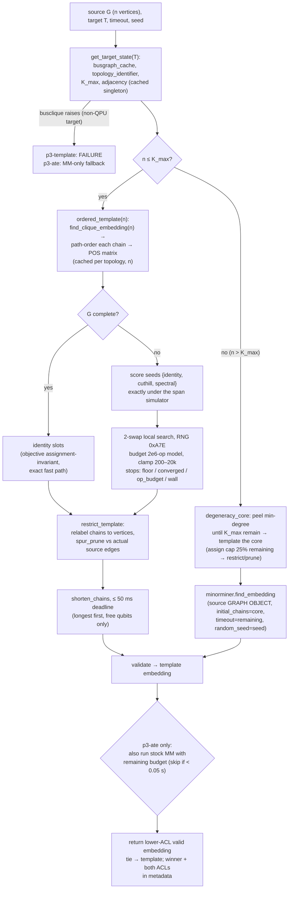

# ATE explained — the adaptive template embedder (`p3-template`, `p3-ate`)

The paper's headline dense arms, explained for a reader new to this project. Ground
truth is the code: `packages/ember-qc/src/ember_qc/algorithms/paper3/_template_core.py`
(shared core) and `.../paper3/ate.py` (the two registered arms), plus the trim/shorten
primitives in `.../algorithms/factored/polish.py`. Spec + as-built record:
`docs/paper3/proposals/ate.md`; lab record: `docs/paper3/notes.md` (§2 anchors, §4.5,
§4.9, §4.10). Every number below is either a constant read from the source or the
printed output of an actual run (`/Users/dabh/ember/.venv/bin/python`).

**Three definitions used throughout.** A *minor embedding* maps each vertex of a source
graph G onto a connected set of physical qubits of a hardware graph T (Chimera / Pegasus
/ Zephyr) such that the sets are disjoint and every source edge has at least one physical
coupler between its two sets. Each such set is a *chain*. *ACL* = average chain length =
total qubits used / number of source vertices — the quality metric; lower is better.

## 1. ELI5

**What the two incumbents do.** *Minorminer* (MM) is a search: it routes each source
vertex's chain through the hardware one at a time, lets chains temporarily overlap, rips
up the worst offenders and reroutes them under rising congestion prices until the
embedding is legal, then polishes chain lengths. It knows nothing about the hardware's
global structure — everything is discovered by local moves. *Raw busclique* (D-Wave's
`minorminer.busclique`) is the opposite: a fixed construction that knows the hardware's
crossbar structure exactly and writes down a clique embedding — of K_n, the all-to-all
graph — instantly. But that is all it does: every chain is full length, every pair of
chains touches whether your graph needs that edge or not, no adaptation to the actual
source, no fallback when the source outgrows the largest clique.

**Why dense graphs favor construction.** A dense graph on n vertices has ~n²/2 edges, so
almost every pair of chains must physically touch, and there is essentially one good
global shape for that on this hardware — the crossbar the chip was designed around, where
n chains run as crossing bars and every pair meets exactly once. Search has to *discover*
that shape through local rip-up moves, and it can't: MM lands 16–57% above the
constructive ceiling (K60 +16%, K100 +39%, K140 +57%; notes §2/§4.12.6), and giving MM
the finished template to polish improves it ≤ 0.04 ACL in 3–42 s (§3.26) — its move set
cannot reorganize chains jointly (§4.3 exhibits the missing pair-moves with
certificates). Above a measurable density crossover p*(n), *build*, don't search.

**Right-sized template.** ATE never takes the biggest clique the chip supports and carves
a piece off: for an n-vertex source it asks busclique for the K_n embedding itself
(`find_clique_embedding(n)`), whose chains are shorter than any subset of a K_max
template's (chain length scales with the clique being built, ~n/12 + O(1) on P16) —
exactly n chains, as short as busclique can make them.

**What the assignment step buys.** The template's n chains are interchangeable for K_n,
but a real source is not K_n — some pairs have no edge. Each template chain is
(empirically always) a *path* of qubits, and its contacts with the other n−1 chains sit
at known positions along that path. After trimming, vertex v's chain only needs the
stretch between the *first* and *last* positions where it touches a chain of an actual
neighbour of v — the *span* of its neighbours' crossing positions. So "which logical
vertex gets which template chain?" has a computable answer: pick the assignment that
lets the chains be trimmed the most, i.e. minimize total span. ATE scores three seed
orders exactly under this prune simulator, then improves the best by deterministic
2-swap local search. Not cosmetic: on ER win cells the shipped assignment beats naive
identity by 3.6–4.8% ACL (§4.9), more than 32 random assignments ever find
(+0.6..+1.8%), and at (n=140, p=0.12) it flips the verdict — the identity-assigned
template *loses* to MM (+0.51/+0.61 ACL) while the assigned one *wins* (−4.7% P16,
−3.6% Z12): assignment moves the crossover p* itself (§4.5).

**What trimming does.** `spur_prune` deletes, one qubit at a time to a fixpoint, every
qubit whose removal keeps its chain connected and every incident source edge covered —
pure overhead by definition, so it can never hurt. On K_n it is *not* a no-op (busclique
leaves coverage-redundant qubits: 4 at K60/P16; 2 of 18 in the K6 walkthrough below);
on non-complete sources it is where the assignment's promised savings are cashed out.
A deadline-bounded `shorten_chains` pass then rebuilds longest chains minimum-length
through free qubits.

**The auto-select.** `p3-template` is the construction alone. `p3-ate` runs the
construction *and* stock minorminer inside one shared budget and returns whichever valid
embedding has the lower ACL (tie → template; winner + both ACLs land in metadata). Below
K_max the construction costs ~0.5–2 s of a 60 s budget, so MM still gets essentially its
full run — hence never worse than MM: where the template wins it wins by 6–33%; on sparse
cells `p3-ate` returns MM's own answer, verified as *exact* ties at K=15 scale (§4.10).

## 2. Complete pseudocode

Faithful to `_template_core.py` / `ate.py`; constants are the shipped defaults.

```
CONSTANTS
  ASSIGN_WALL_CAP_S = 0.100 (2-swap wall cap)     SHORTEN_CAP_S = 0.050
  _ASSIGN_OP_BUDGET = 2_000_000 (op model ≈ cap)  _ASSIGN_MIN/MAX_PROPOSALS = 200/20_000
  _ASSIGN_RNG_SEED = 0xA7E (fixed; run seed never reaches the template path)
  _WALL_CHECK_EVERY = 32 proposals                _MIN_MM_BUDGET_S = 0.05
  default seed = 42 (None → 42); timeout clamped to ≥ 0.01 s

get_target_state(T):                                  # per-target singleton
  bgc = busclique.busgraph_cache(T)                   # raises on non-QPU targets → None
  tid = bgc.topology_identifier()                     # sha256 of the busgraph
  return cached-or-new TargetState(bgc, tid, build_adjacency(T),   # + per-n template
                                   K_max = len(bgc.largest_clique()))       # cache

order_chain_qubits(chain, adj):                       # chain → path order
  start at the min-(induced-degree, label) qubit; greedily walk to the unvisited
  induced neighbour with fewest unvisited neighbours (corridor first, min label
  tie); append any stranded qubits sorted (never happens for busclique chains)
crossing_position_matrix(ordered_chains, adj):        # POS
  POS[i][j] = index in chain i's order of the FIRST qubit target-adjacent to
  chain j (POS[i][i] = 0 unused; -1 if no contact)

ordered_template(state, n):                           # cached per (topology, n)
  if n < 1 or n > K_max: None
  raw = bgc.find_clique_embedding(n)                  # right-sized, never a K_max subset
  chains = [order_chain_qubits(raw[k]) for k in sorted(raw)]
  pos = crossing_position_matrix(chains)
  if any off-diagonal POS entry is -1: None           # template unusable for the simulator
  cache and return (chains, pos)

simulate_pruned_lengths(slots, nbr_idx, pos):         # exact prune simulation
  for each source-vertex index i on chain slots[i]:
    length_i = 1 if N(i) empty, else max−min+1 over {pos[slots[i]][slots[j]] : j∈N(i)}
  objective = Σ length_i                              # "the span objective"

assign_slots(G, verts, pos, wall_cap_s, refine=True):
  nbr_idx from G over verts (sorted node order; repr-sort fallback for mixed labels)
  if G is complete: return identity slots  # objective assignment-invariant (exact fast path)
  seeds = [identity, cuthill_mckee_order(G), spectral_order(G)]   # tie-break in that order
  best = argmin over seeds of simulate_objective      # exact scoring, no target-graph work
  if refine: best = two_swap_refine(best)
  return best slots + info {seed_order, obj_seed, obj_final, local_search}

two_swap_refine(slots, nbr_idx, pos, wall_cap_s):     # deterministic local search
  budget = 2e6 · (wall_cap_s / 0.1) / per_prop, clamped to [200, 20_000],
      per_prop = max(8, 2·(2 + 2·avg_deg)·max(1, avg_deg))
  rng = Random(0xA7E); deadline = now + max(0.005, wall_cap_s)
  loop it in range(budget):
    every 32 proposals: if past deadline → stop "wall_clock" (backstop only)
    if objective ≤ n (every length is ≥ 1) → stop "floor"
    if consecutive rejects ≥ max(200, 4n) → stop "converged"
    pick random pair (a, b); swap slots; recompute only lengths of {a,b} ∪ N(a) ∪ N(b)
    accept iff strictly better, else swap back
  loop exhausts → "op_budget"

restrict_template(G, verts, slots, chains, adj, deadline):
  emb[i] = chains[slots[i]] in vertex-index space (arbitrary hashable labels survive)
  return spur_prune(emb, source-adjacency, adj, deadline)
      # spur_prune (factored/polish.py): to fixpoint, chains then qubits in sorted
      # order: delete q iff chain−{q} stays connected AND every incident source edge
      # stays covered; never below 1 qubit; deadline-safe (each deletion is legal)

template_embed(G, state, deadline):                   # the direct path, n ≤ K_max
  (chains, pos) = ordered_template(state, n)  or fail "busclique template unavailable"
  remaining = deadline − now; if remaining ≤ 0.001 → fail "no time for assignment"
  slots = assign_slots(..., wall_cap_s = min(0.100, 0.5·remaining))
  emb = restrict_template(...)                        # → info.acl_pruned
  if (budget := min(0.050, deadline − now)) > 0.002:
      emb = shorten_chains(emb, deadline = now + budget)
      # longest-first rip-up-and-rebuild through FREE qubits only (other chains
      # forbidden, all placed neighbours re-attach), keep iff strictly shorter,
      # ≤ 8 sweeps                                     # → info.acl_shortened
  return embedding keyed by source vertex             # NO trailing spur_prune (spec)

degeneracy_core(G, k):                                # n > K_max core selection
  peel min-(degree, repr(label)) vertices until k remain; return them
  (= the last-k suffix of the degeneracy elimination order; deterministic)

_template_arm(source, target, state, deadline, seed):
  if n == 0 → FAILURE "empty source graph"
  if n ≤ K_max: emb = template_embed(...); validate; SUCCESS | FAILURE
  else:                                               # ── core + periphery ──
      core = degeneracy_core(source, K_max);  core_sub = source.subgraph(core)
      (chains, pos) = ordered_template(state, |core|)  or FAILURE
      if deadline − now ≤ 0.005 → TIMEOUT "no time for core assignment"
      slots = assign_slots(core_sub, ..., wall_cap_s = min(0.1, 0.25·remaining))
      initial = restrict_template(core_sub, ...)      # pruned core chains
      if deadline − now < 0.05 → TIMEOUT "no time for periphery routing"
      raw = minorminer.find_embedding(source_GRAPH_OBJECT,   # edge-list form would
              list(target.edges()), initial_chains = initial,  # drop isolated vertices
              timeout = remaining, random_seed = seed)  # ← the ONLY seeded template stage
      empty → TIMEOUT if within 10 ms of deadline else FAILURE; validate; SUCCESS
      (MM's raw output is returned — no template-side shorten)

p3-template.embed(source, target, timeout=60, seed=42):
  state = get_target_state(target)  or FAILURE "target not supported by busclique"
  return _template_arm(source, target, state, t0 + timeout, seed)
      # statuses only FAILURE / TIMEOUT; never raises (contract)

p3-ate.embed(source, target, timeout=60, seed=42):
  stage 1 — template arm:
      tmpl_deadline = full deadline if n ≤ K_max (internal caps bound it), else
                      t0 + 0.5·timeout (its MM-periphery stage would eat everything)
      tmpl_emb = _template_arm(...)           # errors caught; never sinks the product
  stage 2 — stock MM, remaining = deadline − now:
      if remaining ≥ 0.05: mm_emb = minorminer.find_embedding(source_GRAPH_OBJECT,
                       edges, timeout=remaining, random_seed=seed), kept if valid
      else: metadata.mm_skipped = "no remaining budget"
  select:  template  iff tmpl_emb exists and ACL(tmpl) ≤ ACL(mm)   # tie → template
           else mm   iff mm_emb exists
           else fail (TIMEOUT if at deadline, else FAILURE, "both arms failed")
  metadata: winner, acl_template/acl_mm (4 dp), k_max, template_mode,
            assign_order/obj_seed/obj_final, template_err if any
```

## 3. Diagrams

### 3a. Pipeline flowchart



(`p3-template` stops at "template embedding"; `p3-ate` gives stage 1 the full deadline
below K_max, `timeout/2` above it, then MM the remainder.)

### 3b. The crossbar, crossing positions, and the pruned span

Busclique's K_n template is a crossbar: chains run as crossing bars and every pair meets
in exactly one cell. Abstractly (here 3 "horizontal" and 3 "vertical" chains of K6):

```
                 c3   c4   c5          each + is the single cell where the
                  |    |    |          two chains' qubits are coupled
        c0  ──────+────+────+──
        c1  ──────+────+────+──        chains c0..c2 also meet each other
        c2  ──────+────+────+──        (and c3..c5 each other) in a shared
                  |    |    |          end cell — every pair touches once
```

Each chain is a path of qubits; walking it end-to-end gives every qubit a *position*, and
POS[i][j] records where along chain i the contact with chain j sits. Trimming keeps only
the span between a vertex's first and last useful contact:

```
   chain assigned to v      (positions along the path)
   pos:     0     1     2     3     4     5     6
   qubit:  q0 ── q1 ── q2 ── q3 ── q4 ── q5 ── q6
                  ↑           ↑     ↑
              u1's chain   u2's chain  u3's chain   ← first contacts with the chains
                                                      of v's ACTUAL neighbours u1..u3
   span kept:    [q1 ········································ q4]   length 4 = (4−1)+1
   spur-pruned:  q0   and   q5, q6   deleted  (nothing outside the span is needed)
```

Assignment chooses *which* vertex gets *which* chain so these spans are collectively
smallest — before/after from the K6−e walkthrough below (chain `[36, 44, 40]`, contacts
with slots 0–3 at position 0, with slot 5 at position 1):

```
   before (as v4's chain, neighbours on slots 0,1,2,3,5):   after assignment moves v0
   pos:     0      1      2                                 (neighbours on slots 0..3
   qubit:  36 ─── 44 ─── 40                                  only) onto this chain:
            ↑      ↑
        slots 0-3  slot 5        span [36 ── 44], len 2      span [36], len 1 — the
                                                             3-qubit chain becomes 1 qubit
```

## 4. K₆ walkthrough with real numbers

All output below is from actual runs (`.venv` python, minorminer 0.2.22, networkx 3.4.2,
dwave-networkx 0.8.19): `nx.complete_graph(6)` on `dnx.chimera_graph(4)` (128 qubits,
352 couplers), then K6 minus one edge, then a Pegasus aside. Target state:
`topology_identifier() = f063aa6a13ae1888…`, **K_max = 16** on C4.

**Raw busclique K6** (`find_clique_embedding(6)`), six 3-qubit chains, ACL 3.0:

```
key 0: [0, 4, 32]    key 1: [1, 5, 33]    key 2: [2, 6, 34]
key 3: [3, 7, 35]    key 4: [36, 40, 44]  key 5: [37, 41, 45]
```

**Path ordering.** `order_chain_qubits` walks each chain from a min-degree endpoint:
slot 0 becomes `[4, 0, 32]` (qubit 4 = horizontal arm in cell (0,0); 0→32 = vertical leg
down column 0), slots 1–3 likewise; slots 4–5 become `[36, 44, 40]` / `[37, 45, 41]`
(horizontal runs along row 1). Slots 0–3 meet each other in cell (0,0)'s K4,4, meet
slots 4–5 in cell (1,0); slots 4 and 5 meet in cell (1,1).

**POS matrix** (row i, column j = position in chain i of the first contact with chain j):

```
        j=0  j=1  j=2  j=3  j=4  j=5
  i=0:   0    0    0    0    2    2
  i=1:   0    0    0    0    2    2
  i=2:   0    0    0    0    2    2
  i=3:   0    0    0    0    2    2
  i=4:   0    0    0    0    0    1
  i=5:   0    0    0    0    1    0
```

Read row 0: chain 0 touches chains 1–3 already at position 0 (qubit 4 — and again at
position 1; POS keeps the *first*), but chains 4–5 only at position 2 (qubit 32, cell (1,0)).

**Assignment — the complete fast path.** For K6 every bijection has the same objective;
`assign_slots` detects `m2 == n(n−1)` and returns identity without scoring or search
(rows 0–3 span positions 0..2 → 3; rows 4–5 span 0..1 → 2):

```
slots: [0, 1, 2, 3, 4, 5]
info: {'n': 6, 'seed_order': 'identity', 'obj_seed': 16, 'obj_final': 16, 'complete_skip': True}
simulated pruned lengths: [3, 3, 3, 3, 2, 2]   total 16
```

**Spur-prune is not a no-op on K6.** The real prune removes 2 of 18 qubits:

```
v0: [4, 0, 32]   → [0, 32]      removed: 4
v4: [36, 44, 40] → [36, 44]     removed: 40
v1, v2, v3, v5: unchanged;   total 18 → 16 qubits;  ACL 3.0000 → 2.6667
```

Qubit 4 is removable from v0 because position 1 (qubit 0) *also* touches chains 1–3 — a
duplicate contact; qubit 40 is a redundant tail (44 already covers chain 5). This is the
§4.3 finding in miniature: busclique leaves coverage-redundant qubits even on K_n (4 of
404 at K60/P16; 2 of 18 here). Sequential coupling shows too: once v0 is pruned first
(sorted order), v1 must keep qubit 5 — dropping it would orphan edge (0,1) — the same
slack cannot be cashed twice. The simulator's total (16) matches the real 16 with a
different per-vertex split ([3,3,3,3,2,2] vs [2,3,3,3,2,3]): its documented
multiple-contact over-estimate on v0, offset exactly.

**Shorten, final arms.** `shorten_chains` rebuilds two chains through free qubits into
the crossing cell (v1 → `[33, 38]`, v2 → `[34, 39]`): 16 → 14 qubits.

```
template_embed info: acl_pruned 2.6667 → acl_shortened 2.3333
p3-template: ACL 2.3333, 0.009 s, meta {'k_max': 16, 'template_mode': 'direct',
             'assign_order': 'identity', 'assign_obj_seed': 16, 'assign_obj_final': 16}
p3-ate:      ACL 2.3333, 0.012 s, meta {'winner': 'template',
             'acl_template': 2.3333, 'acl_mm': 2.3333, ...}
stock minorminer, seed 0: ACL 2.3333 (chain lengths [2,2,2,2,3,3]), 0.002 s
p3-template output identical across seeds 0/1/2: True
```

`p3-ate` ran both arms: its internal MM stage matched a standalone stock-MM run at the
same seed (2.3333 = 2.3333), the selector saw a tie, and the tie rule returned the
template. K6 is too small to show a margin (K16 on this C4: template ACL 4.875 in
17 ms; the §3.26-scale gaps appear from K60 up: 6.73 vs 7.83, …, K140 13.17 vs 20.72).

**K6 minus edge (0,5) — where assignment and trim actually bite.** Same target, same
template, but now the fast path is off and the optimizer runs:

```
identity slots [0,1,2,3,4,5]: objective 16, simulated lengths [3,3,3,3,2,2]
assign_slots chose [4,1,2,3,0,5]: objective 14, simulated lengths [1,3,3,3,3,1]
   local_search: {'proposals': 219, 'accepted': 1, 'capped_by': 'converged'}
```

All three seed orders tie at 16 (verified), so refinement starts from identity (derived
proposal budget 18,907; converged after 219 proposals, exactly one accepted swap,
v0↔v4). That swap puts the two endpoints of the *missing* edge on slots 4 and 5 — the
two chains whose only expensive contact is with *each other* (POS[4][5] = POS[5][4] =
1); with the edge absent, both collapse to their position-0 qubit. The real prune
confirms, half a qubit per vertex better than identity:

```
identity : v0 slot0 → [0,32]; v4 slot4 → [36,44]; v5 slot5 → [37,41,45] (all 3 kept)
           total 16 qubits, ACL 2.6667
optimized: v0 slot4 [36,44,40] → [36]; v5 slot5 [37,45,41] → [37]   (3-qubit chains
           trimmed to ONE qubit); v1 slot1 → [1,33]; v4 slot0 → [0,4,32] (keeps 3);
           v2, v3 unchanged;  total 13 qubits, ACL 2.1667
```

(Simulator said 14, reality is 13 — v1 gained a qubit from the multiple-contact effect;
the as-built validation table bounds the mismatch at ±1–2 qubits/vertex, total ≤ ~3%.)
After shorten, both `p3-template` and stock MM land on ACL 1.8333 for this toy; at scale
the same mechanism is worth +3.6..4.8% over identity (§4.9) and flips the (140, 0.12)
cells from loss to win (§4.5).

**Pegasus aside.** On `dnx.pegasus_graph(4)` (264 qubits, 1604 couplers): K_max = 36,
the K6 template chains are all length *2*, and the POS matrix is two-valued (row
patterns `[0,0,0,0,0,0]`, `[1,1,0,0,0,0]`, `[1,1,1,1,0,0]` — Pegasus's extra couplers
put many contacts at position 0). Objective 10, final ACL **1.3333** (`complete_skip`
fast path, `assign_obj_seed = assign_obj_final = 10`). Core+periphery smoke on C4:
ER(20, 0.5), n=20 > K_max=16 → `template_mode: core_periphery`, `core_size: 16`,
`assign_order: cuthill` (obj 70→69), ACL 4.8 in 0.033 s.

## 5. Other details

**Determinism.** Below K_max the template path consumes no run seed anywhere: the 2-swap
RNG is fixed (`0xA7E`), seed orders are deterministic (`spectral_order` pins the
eigensolver seed and canonicalizes the Fiedler sign), prune/shorten visit in sorted
order, and the assignment cap is a deterministic proposal-count budget (2e6-op model)
with the wall clock only as a backstop checked every 32 proposals — reruns are
bit-identical unless the host is far slower than the model. Verified live above (seeds
0/1/2 identical) and at M4 scale: cross-seed ACL variance exactly 0.00x above p*, and
exactly 1.00x (MM's own) where `p3-ate` defers to MM (§4.10). The run seed reaches only
the two MM stages (core-periphery routing; `p3-ate` stage 2); default 42.

**Complete-graph fast path.** For K_n the span objective is provably
assignment-invariant (every row contributes its full span under any bijection), so seeds
and refinement are skipped — an exact shortcut, not an approximation. §4.9's K_n control
cells measured exactly +0.00% across 32 random assignments, confirming it on real prune.

**Caching.** One `TargetState` per topology per process, keyed by busclique's own
`topology_identifier()` (sha256 of the busgraph — stable across instances/processes,
distinct per broken-qubit variant), holding the frozen adjacency, K_max, and the lazy
per-n `(ordered chains, POS)` cache. Warm construction ~14 ms on P16 (busclique's own
disk cache does the heavy lifting).

**Timeouts and tiny budgets.** `timeout` clamps to ≥ 0.01 s; stages degrade safely.
Assignment needs > 1 ms remaining (else `"no time for assignment"`) and is capped at
min(100 ms, 50% remaining) (25% in the core path); prune/shorten are deadline-bounded
and validity-preserving move-by-move (cutting them short is legal); shorten is skipped
below 2 ms; MM stages need ≥ 0.05 s. Measured on the C4 toy: `p3-template` at
`timeout=0.001` (→ 0.01) still finished K12 at ACL 3.833; `p3-ate` at 0.02 returned the
template with `mm_skipped: "no remaining budget"`. Statuses are only FAILURE / TIMEOUT;
`embed` never raises (both classes catch everything and return a failure dict).

**Failure modes.** (i) Non-busclique target: `busgraph_cache` raises internally →
`p3-template` fails with `"target not supported by busclique (non-Chimera/Pegasus/Zephyr)"`;
`p3-ate` records `template_mode: "unavailable"` and degrades to a pure
stock-MM run (verified live: winner=mm, valid embedding). (ii) n > K_max with no MM
success: the periphery stage's empty return maps to TIMEOUT if within 10 ms of the
deadline, else FAILURE; both `p3-ate` arms failing → `"both arms failed"`. (iii) Empty
source → FAILURE. (iv) Isolated vertices work throughout: the simulator scores them 1,
spur_prune keeps ≥ 1 qubit, and both MM calls pass the source as a *graph object* since
minorminer's edge-list form silently drops isolated vertices (verified: K5 + isolated
vertex 7 → chain `[45]`). Mixed-type labels survive via repr-sort and index-space chains.

**The K180 / K184 frontier.** K_max = 180 on Pegasus P16, 184 on Zephyr Z12 (§4.0.5).
Up to those sizes the template is a deterministic 100%-success construction where search
dies: MM's 60 s dense cliff is n=140 on both topologies; on K180(P16)/K179(Z12)
template/ate went 5/5 at ACL 16.64/12.97 while MM, cuthill, and attraction were 0/5
(§4.5, §4.10); Z12's K184 template lands at 12.98 — better than MM on K140 (15.09), 44
vertices smaller — and K189 > 184 fails for every arm (the busclique bound). Past K_max,
core+periphery (densest-K_max degeneracy core, MM routes the rest from `initial_chains`)
inherits the CLMM-style frontier extension (Zbinden's K185+ on P16); `p3-ate`'s 50/50
split applies only there. §4.7 caveat: the cliff is budget-dependent, so frontier
claims carry their 60 s budget.

**Cost profile.** Template stage at n=100–160 on P16: 0.5–2.1 s wall, dominated by the
exact `spur_prune` fixpoint (assignment ≤ 100 ms and shorten ≤ 50 ms caps hold); small n
is milliseconds (K6@C4 9 ms, K16@C4 17 ms). So inside a 60 s `p3-ate` budget MM still
gets ~58+ s below K_max — what makes never-worse cheap. Measured product: above-p*
margins −6.5..−18.4% (ER), −19.5/−32.9% (K140 P16/Z12) at Holm p = 6.3e-13,
rank-biserial 0.99–1.00, exact all-ties on sparse controls (§4.10); also beats the
practitioner default `minorminer-layout` on every above-p* cell (§4.10b).

**Code/spec divergences found (code wins; verified against source).**

1. *"~ms below K_max" is stale for large n.* `ate.py`'s module docstring and the
   stage-1 comment in `P3ATE.embed` say the template path costs "~ms"; measured cost is
   0.5–2.1 s at n=100–160 (spur_prune-dominated). `ate.md`'s as-built section corrects
   the spec; the code comments still carry the optimistic figure.
2. *`degeneracy_core` tie-break is repr-lexicographic, not numeric.* Docstring says
   "min (degree, label) peel"; the code keys on `(deg[u], repr(u))`, so at equal degree
   vertex 10 peels before vertex 2. Deterministic either way, but the documented order
   is not the implemented one (core membership can differ on ties).
3. Spec-vs-build deviations already disclosed in ate.md, confirmed in code: the 100 ms
   assignment cap is an op-count budget with wall backstop (not a bare wall cap); no
   second spur_prune after shorten; the selector compares template pruned+shortened ACL
   vs MM *raw* ACL (no MM-side polish in-arm); the 2-swap gained floor/convergence
   stops. One nuance the spec's `search_arm(G, T, remaining_budget)` line hides: below
   K_max stage 1 gets the *full* deadline; the 50/50 split exists only above K_max.
4. Trivia: `p3-template`'s success dict carries no `success`/`status` keys (failures
   only); the `p3-ate` MM-stage validity check omits the cached adjacency (must work
   when target state is None); `template_embed`'s `refine=`/`shorten=` ablation kwargs
   are not exposed through the registered arms (script route only, per spec).
