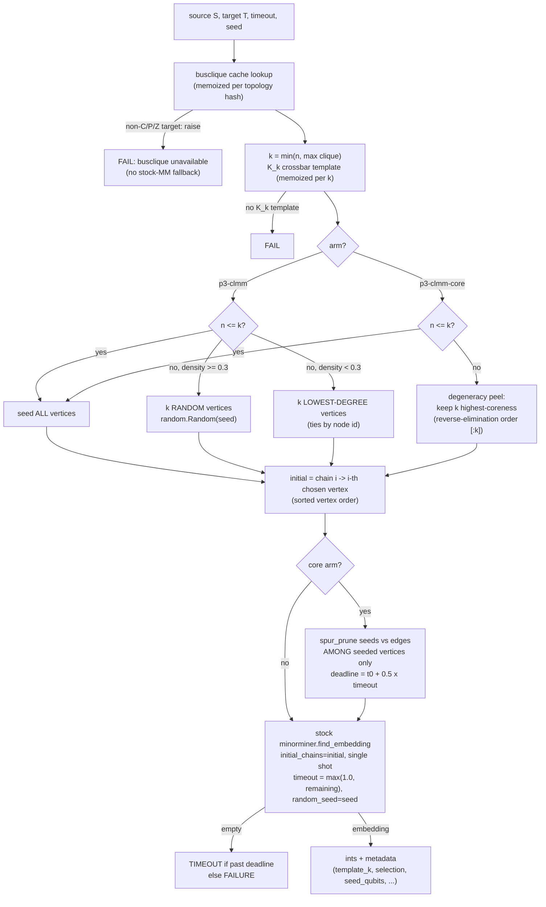

# CLMM++ explained — `p3-clmm` and `p3-clmm-core`

Explainer for the clique-template-seeded minorminer arms. Ground truth is the code:
`packages/ember-qc/src/ember_qc/algorithms/paper3/clmm.py` (both arms live in one
`_clmm_embed` pipeline). Spec + as-built record: `docs/paper3/proposals/clmm.md`;
literature background: `docs/paper3/survey.md` (Zbinden et al. 2020, ISC LNCS 12151);
measured verdicts: `docs/paper3/notes.md` §4.1/§4.1b (E0), §4.5 (M3 kill gate), §4.10
(M4 eval). Where docs and code disagree, this file follows the code and flags the
difference in section 5.

## 1. ELI5

**Terms.** A *minor embedding* maps each source vertex to a connected set of hardware
qubits (its *chain*) so that every source edge has at least one coupler between the two
chains. *ACL* = average chain length (qubits used / n; lower is better). *MM* = stock
minorminer 0.2.22, the incumbent search heuristic. *busclique* = minorminer's polynomial
clique-embedding engine for Chimera/Pegasus/Zephyr: `find_clique_embedding(k)` returns a
right-sized native embedding of the complete graph K_k — the "crossbar" template of k
chains in which **every pair of chains already touches**.

**MM's blank slate.** Stock MM starts from nothing: an initialization pass builds chains
one variable at a time (overlaps between chains allowed), then overfill passes tear up
and reroute chains until no qubit is shared, then a shortening phase polishes lengths.
On dense graphs the overfill grind is the killer: MM's 60 s feasibility cliff sits at
n = 140 at *every* density p ∈ {0.2..1.0}, on both P16 and Z12 (§4.1 output 4).

**CLMM's move (Zbinden, Bärtschi, Eidenbenz, Djidjev 2020).** Hand MM a head start:
pass the k-clique crossbar as `initial_chains`, with k = min(n, busclique max clique).
Because a clique embedding satisfies *every possible* edge among the seeded vertices,
all source edges inside the seeded set are pre-satisfied and no seeded chain overlaps
another. When k = n, MM's initialization pass keeps every seeded chain (each is present
and linked to all neighbours — `pathfinder.hpp:265-280`), the state is already legal,
and MM spends its whole budget in the shortening phase. When k < n, MM only has to grow
the n−k unseeded vertices into an already-consistent scaffold and legalize locally.
Crucially, `initial_chains` are *hints*, not constraints (unlike `fixed_chains`): every
later pass may tear up and rebuild any chain, seeds included.

**Why it matters most mid-band and at the frontier.** Mid-density is where both pure
strategies are weak: MM's grind is slow, and the raw template is wasteful (it pays for
all C(k,2) clique adjacencies when the source has far fewer edges). CLMM interpolates —
free global structure from the template, plus MM's reshaping to shed what the source
does not need. Measured (E0, §4.1): `clmm` beats stock MM in 43/67 MM-feasible paired
cells — every cell with n ≥ 80, p ≥ 0.3, plus the mid-band down to p = 0.08 — by up to
−30.5% ACL (P16 K140), and still wins at (140, 0.12) on P16 (−0.46 median, 10/5), a
cell *below* the raw template's own crossover p*(140) ∈ (0.12, 0.2]. At the feasibility
frontier the seed pre-solves the global routing MM cannot discover: on their Pegasus
target only CLMM reached K185+ (survey.md); on our defect-free targets E0 reproduces
the frontier at the busclique bound — clmm embeds P16 K180 and Z12 K184 (plus 12 cells
where MM is 0-for-all) while MM dies just past K140.

**Faithful vs `-core`.** `p3-clmm` is the faithful reproduction (the literature
control): when k < n, Zbinden's selection rule picks *which* k vertices get seeded —
k **random** vertices when edge density ≥ 0.3, k **lowest-degree** vertices when
sparser. `p3-clmm-core` replaces the selection with the **degeneracy core**: peel the
source by the min-degree elimination order and keep the k last-eliminated (highest-
coreness) vertices — the hard sub-structure — then **spur-prune** each seed chain
against only the source edges *among seeded vertices*, so the seed stops paying for
clique adjacency the core does not need. The periphery is left entirely to MM's search,
the regime where MM excels.

**Versus the neighbours in the family.** Raw busclique (`p3-template`) takes the
template as-is (assignment + trim; MM never touches it). ATE (`p3-ate`) runs the
template arm *and* stock MM independently inside one budget and returns whichever
embedding is better — MM as an alternative, never a refiner. CLMM is the third
relationship: the template is a *starting state inside* MM's own dynamics, which may
keep, reshape, or discard it.

## 2. Complete pseudocode

Constants, from the code: `_DENSITY_SPLIT = 0.3`, `_MM_FLOOR_S = 1.0` s,
`_PRUNE_BUDGET_FRAC = 0.5` (core arm only). `embed()` defaults: `timeout = 60.0` s,
`seed = 42` when the kwarg is absent. Both arms are the same pipeline with one flag:

```
_clmm_embed(S, T, timeout, seed, core_seeding):
    t0 = perf_counter(); deadline = t0 + timeout
    FAIL(msg, status="FAILURE") means return
        {"embedding": {}, "time": now-t0, "success": False, "status": status, "error": msg}

    n = |V(S)|; if n == 0: FAIL("clmm: empty source graph")

    # -- busclique cache lookup (module-level memo, keyed by topology hash) --
    entry = _BUS_ENTRIES[busgraph_cache(T).topology_identifier()]
        on miss: {"cache": busgraph_cache(T), "maxclique": len(cache.largest_clique()),
                  "adj": None (lazy), "templates": {}}
        busgraph_cache raises for non-{chimera,pegasus,zephyr} targets
            -> FAIL("clmm: busclique unavailable ...")   # NO silent stock-MM fallback

    k = min(n, entry.maxclique)
    chains = entry.templates[k]           # memoized; on miss:
        raw = cache.find_clique_embedding(k)
        if not raw or len(raw) < k: FAIL("clmm: busclique returned no K_k template")
        chains = [[int(q) for q in raw[key]] for key in sorted(raw)]   # k chains, index order
        (always hand out FRESH copies — memoized lists are never aliased or mutated)

    # -- seed-vertex selection --
    nodes = sorted(V(S))                  # str-keyed sort if labels are non-comparable
    if core_seeding:
        chosen = nodes                       if n <= k        # selection = "all"
               = sorted(degeneracy_order(S)[:k])  otherwise   # selection = "core"
          # degeneracy_order = repeated-min-degree elimination (ties by node id),
          # REVERSED into placement order; [:k] keeps the k LAST-eliminated =
          # highest-coreness end. Equivalently: peel until <= k vertices remain.
    else:                                                     # Zbinden's rule
        if n <= k:                    chosen = nodes          # selection = "all"
        elif nx.density(S) >= 0.3:    chosen = sorted(random.Random(seed).sample(nodes, k))
                                                              # selection = "random"
        else:                         chosen = sorted( sorted(nodes,
                                          key=(degree(v), v))[:k] )   # selection = "lowdeg"

    initial = { chosen[i] -> chains[i] for i in 0..len(chosen)-1 }   # index assignment,
    seed_qubits_pre = total qubits in initial                        # sorted vertex order

    # -- core arm only: spur-prune the seeds --
    if core_seeding:
        prune_deadline = min(deadline, t0 + 0.5 * timeout)
        run in INDEX SPACE: map chosen -> 0..k-1; source adjacency restricted to
        edges with BOTH ends in chosen; frozen target adjacency from entry (lazy build)
        initial = spur_prune(initial_idx, seeded_adj_idx, target_adj, deadline=prune_deadline)
          # spur_prune (factored/polish.py): delete qubit q from chain(v) iff
          # chain-{q} stays connected AND every source-neighbour chain is still
          # touched; sorted deterministic sweeps to a fixpoint; stopping at the
          # deadline is safe (validity-preserving move by move); chains never < 1 qubit
    seed_qubits = total qubits in initial

    # -- single-shot stock MM (no restarts: CLMM is not a restart scheme) --
    remaining = max(1.0, deadline - now)                     # the >= 1 s MM floor
    emb = minorminer.find_embedding(S_as_GRAPH_OBJECT,       # edge-list form would
                                    list(T.edges()),         #   drop isolated vertices
                                    initial_chains=initial,
                                    timeout=remaining,
                                    random_seed=int(seed))   # skip_initialization
                                                             #   left at default False
    if emb is empty:
        FAIL("clmm: MM stage returned empty",
             status = "TIMEOUT" if now >= deadline else "FAILURE")

    return {"embedding": {v: [int(q) ...]}, "time": now-t0,
            "metadata": {template_k: k, n_seeded: |initial|, selection,
                         seed_qubits_pre_prune, seed_qubits, maxclique}}
    # NOTE: the success dict carries NO "success"/"status" keys — only failures do.
    any exception anywhere -> FAIL("clmm: <e>")              # contract: never raise
```

`p3-clmm` = `core_seeding=False`; `p3-clmm-core` = `core_seeding=True`. Same seed,
same inputs → same output (verified live; the only RNG uses are `random.Random(seed)`
in the dense-selection branch and MM's own `random_seed=seed`).

## 3. Diagrams



Cold start vs warm start (right side is the *actual* K6-on-C4 seed from section 4):

```
  MM cold start                          CLMM warm start (K6 on chimera_graph(4))
  -------------                          ----------------------------------------
  chains are grown one at a time         var0 [0,4,32]  ~ four L-shaped chains:
  from nothing, each routed toward       var1 [1, 5,33] ~ vertical qubit i and its
  the chains already placed;             var2 [2, 6,34] ~ horizontal partner i+4 in
  overlaps allowed at first.             var3 [3, 7,35] ~ cell(0,0), plus i+32 below
  Then the overfill passes tear          var4 [36,40,44] ~ two horizontal chains
  up and reroute until no qubit          var5 [37,41,45] ~ through cells (1,0),(1,1)
  is shared -- the grind that
  eats the budget dense, and             vars 0-3 meet pairwise inside cell(0,0);
  kills MM outright past n=140.          vars 4-5 cross vars 0-3 in cell(1,0) and
  Every edge must be earned.             each other in cell(1,1): all 15 K6 edges
                                         pre-satisfied, zero overlap. MM starts
                                         LEGAL and only reshapes/shortens; with
                                         k < n it grows the periphery into the
                                         crossbar and legalizes around it.
```

## 4. K6 walkthrough with real numbers

All runs: `/Users/dabh/ember/.venv/bin/python`, minorminer 0.2.22, networkx 3.4.2,
`timeout=20.0`, `seed=0`, capturing the exact `initial_chains` handed to MM by wrapping
`minorminer.find_embedding`. Chains displayed sorted.

**K6 on `dnx.chimera_graph(4)`** (128 qubits; busclique max clique 16 → k = min(6,16)
= 6, selection `"all"`, n_seeded 6).

- Seeds (`p3-clmm`): the 3-qubit crossbar above — 18 qubits, seed ACL 3.0.
  `{0:[0,4,32], 1:[1,5,33], 2:[2,6,34], 3:[3,7,35], 4:[36,40,44], 5:[37,41,45]}`.
- MM returns in 3 ms with ACL **2.3333** (14 qubits) — and **kept 0 of 6 seeds
  verbatim**. Qubit-by-qubit: `0:[0,4,32]→[36,44]`, `1:[1,5,33]→[39,42,47]`,
  `2:[2,6,34]→[34,37]`, `3:[3,7,35]→[3,4,35]`, `4:[36,40,44]→[32,38]`,
  `5:[37,41,45]→[1,33]`. The seed made the state legal instantly, so the entire run
  was MM's shortening phase, which reshaped every chain (18 → 14 qubits, beating the
  raw template's 3.0) — but stayed **in the seeded corner** of the chip (qubits 1–47).
  Plain MM, same seed: also ACL 2.3333 in 2 ms, but in the opposite corner (qubits
  88–127). Same quality, different basin: at toy scale the seed decides *where*, not
  *how well*.
- `p3-clmm-core`, same instance: selection still `"all"`, but spur-prune fires first
  and trims 18 → 16 seed qubits (`0:[0,4,32]→[0,32]`, `4:[36,40,44]→[36,44]`; the
  crossbar has slack even for a full K6). Final: ACL 2.3333 again, 0/6 seeds verbatim.

**K6 on `dnx.pegasus_graph(4)`** (264 qubits; max clique 36): seeds are six 2-qubit
chains (12 qubits, ACL 2.0); final ACL **1.3333** (four 1-qubit chains + two 2-qubit) —
here exactly **1 of 6 seeds survives verbatim** (`2:[30,162]`), and one final chain is
another vertex's seed (`5:[33,165]` was var 3's seed — chains migrate freely). Plain MM,
same seed: 1.3333. Pegasus' degree-15 fabric makes K6 near-native; nothing to win.

**Mid-band, k < n: `nx.gnp_random_graph(20, 0.3, seed=1)` on `chimera_graph(4)`**
(n=20, m=58, realized density 0.3053; k = maxclique = 16, so 4 vertices go unseeded).

- `p3-clmm`: density 0.3053 ≥ 0.3 → selection `"random"`. `random.Random(0).sample`
  seeds {0–9, 11, 12, 13, 15, 17, 19}; unseeded {10, 14, 16, 18} — note the sample is
  degree-blind: it left out the degree-10 vertex 10. Each seed is a 5-qubit K16
  crossbar chain (80 qubits, seed ACL 5.0 — massively over-provisioned for a 58-edge
  source). Final: ACL **3.00** in 21 ms, 0/16 seeds verbatim (MM cut 80 seed qubits to
  a 60-qubit embedding while growing the 4 periphery vertices).
- `p3-clmm-core`: degeneracy placement order starts [16, 10, 8, 7, 9, 18, 1, 17, 0,
  19, 14, 13, 12, 4, 15, 3, ...]; first 16 → seeded {0,1,3,4,7,8,9,10,12,13,14,15,16,
  17,18,19}, periphery {2,5,6,11} (degrees 3,3,4,3 — exactly the low-degree tail the
  peel discards). Spur-prune, checking only edges among the 16 seeded vertices, trims
  80 → 65 seed qubits (e.g. var 3's chain 5 → 2 qubits). Final: ACL **3.20** in 15 ms;
  3/16 seeds kept verbatim (vars 7, 10, 19 — pruned chains are cheaper to keep).
- Plain MM, same seed: ACL **2.75** in 11 ms — **stock MM wins this toy cell**, and
  that is the honest reading: n=20 is far below the win region (E0: clmm's wins start
  at n ≥ 80 for p ≥ 0.3; at n=40 even the constructive family only wins at p ≥ 0.7).
  The walkthrough shows the *mechanism*; the *payoff* lives at n=80–220 where MM's
  grind — absent here at 11 ms — costs 30–60 s.

## 5. Other details

**Memoized busgraph state.** Module dict `_BUS_ENTRIES` keyed by
`busgraph_cache(T).topology_identifier()` — a topology hash, so any graph object of
the same topology shares one entry holding the cache object, the max-clique size
(P16 → 180, Z12 → 184, C4 → 16, P4 → 36), the lazily built frozen target adjacency
(core arm only), and every per-k chain template. Constructor ≈ 70 ms warm; first call
per topology pays `largest_clique()` (busclique disk-caches it); everything after is a
dict hit. `_template_chains` returns fresh copies so results/pruning never mutate the
memo.

**Determinism.** Same (instance, seed) → identical embedding, both arms (verified
live). This is what makes the paired-by-(instance, seed) protocol meaningful.

**Regime caveats (measured).**
- *Sparse is a loss, by design of the mechanism:* E0 — faithful clmm loses in the 21
  sparse cells (worst +1.11 median ACL); M4 eval — sparse losses +13..+16%,
  Holm-significant. The product regime-gates clmm to dense/mid; M5's committed
  prediction is sparse-family regressions needing that gate.
- *Z12 mid-band weakness:* the mid-band ACL win is Pegasus-specific at n=100–140.
  §4.5 dev: P16 (100,0.2) −4.7% (20/5) and (140,0.12) −2.9% (16/9) — B1 PASS — but
  the same cells on Z12 read +2.8% (7/18) and +0.4% (12/13). §4.10 eval reproduces
  it: Z12 (100,0.2) +1.1%, (140,0.12) +5.2%, while P16 dense/mid wins run −6..−15.9%
  Holm-significant.
- *`-core` backfires below the crossover:* §4.5 — clmm-core beats clmm at (140,0.2)
  on BOTH topologies (−15.0% vs −12.9% P16; −14.9% vs −12.4% Z12) and ties-or-beats
  at K_n (B2 PASS), but at (140,0.12) it flips to +5.0/+5.6% where faithful clmm reads
  −2.9/+0.4 — hence its M4 role is density-gated. §4.10 confirms: (140,0.2) −14.8%,
  (140,0.12) +3.7%. Bonus property: cross-seed variance 0.06x MM's median — core
  seeding near-determinizes the search.

**Frontier (K179–K184).** Dev/eval anchors K180 (P16) and K179 (Z12): clmm (and
clmm-core) 5/5 where MM, cuthill, mmpolish and attraction are all 0/5 (§4.5, §4.10).
ACL at the frontier is template-grade or a hair better: Z12 K179 clmm 12.961 vs
template 12.972 (4/0/1, §4.5 B3). E0 extends to the busclique bound — Z12 K184 embeds
(template ACL 12.98, clmm tracking it within hundredths, *better than MM's own K140*
at 15.09), and K189 is all-fail. Caveat:
the cliff is budget-dependent (§4.7) — the M2 local smoke saw K182 fail for *all*
arms at 30 s, and MM's cooperative timeout overshot by 9–29 s there; frontier claims
must state their budget.

**Speed.** 2–4x faster than MM at n ≤ 100 (E0; full budget at n=140). Mechanism: the
seeds pre-satisfy the seeded subgraph's edges, so MM skips most of the overfill grind
and reaches the (cheap-to-enter, patience-limited) shortening phase quickly — e.g. the
M2 smoke's ER(100,0.5): clmm 12–15 s vs MM ~30 s at −22% ACL.

**Failure modes.** (i) Non-busclique target (e.g. an arbitrary graph): clean FAILURE
"busclique unavailable" — deliberately no stock-MM fallback (fallback arms are explicit
`-fb` per protocol). (ii) Empty source: FAILURE. (iii) No K_k template despite the
k = min(n, maxclique) guard: FAILURE (defensive). (iv) MM returns {}: TIMEOUT if past
the deadline, else FAILURE. (v) Any exception: caught, logged, FAILURE dict — the arm
never raises and never prints. Note the arm can overshoot the caller's timeout: MM's
`timeout` is cooperative and the `max(1.0, remaining)` floor guarantees MM ≥ 1 s even
if the template stage ate the budget (e0-parity choice; the harness grace period
absorbs it).

**Divergences found (code vs docs).**
1. *Density source (documented, deviation 1 in clmm.md):* the e0 script arm branches
   on the generator parameter p; the registered arm branches on realized
   `nx.density(source)`. Our walkthrough instance shows the hazard scale: gnp(20, 0.3,
   seed=1) realizes 0.3053 — a p=0.3 instance realizing < 0.3 would take the lowdeg
   branch the script arm would not. Only matters when k < n.
2. *Success dict shape:* success returns carry only {embedding, time, metadata} — no
   "success"/"status" keys (failures carry both). Neither clmm.md nor the module
   docstring states this asymmetry; the runner infers success from the embedding.
3. *Spec §Mechanism-2 not built (documented):* the seed-form sweep (raw vs pruned vs
   prune-to-core-subgraph) and the k-ladder k ∈ {n/4, n/2, 3n/4, K_max} exist nowhere
   in clmm.py — script-route kwargs by design, registered names only for survivors.
4. *"MM legalizes around the seeds" is doc shorthand, not a constraint:* as the K6 runs
   show (0/6 seeds kept on C4, 1/6 on P4), MM freely tears up seed chains — they are
   initialization hints that set the basin, and with k = n the "legalization" is
   actually pure shortening. The docs' phrasing is accurate about the call
   (`skip_initialization=False`, no `fixed_chains`) but easy to over-read.
5. *Minor docstring nit:* clmm.py's header says spur-pruned seeds mean "the seed pays
   only for adjacency the core actually needs" — spur_prune also keeps qubits needed
   for chain *connectivity*, so pruned seeds are minimal w.r.t. single-qubit deletions,
   not globally minimal (see the K6 case: only 2 of 18 qubits removable).

**Rerun.** The walkthrough is one script against the live arms; regenerate with
`.venv/bin/python` on graphs `nx.complete_graph(6)`, `nx.gnp_random_graph(20, 0.3,
seed=1)`, targets `dnx.chimera_graph(4)` / `dnx.pegasus_graph(4)`, `seed=0`,
`timeout=20.0`, wrapping `minorminer.find_embedding` to capture `initial_chains`.
