# The exact-repair polish, explained (`p3-mmpolish` / `joint_repair.py`)

Explainer for `packages/ember-qc/src/ember_qc/algorithms/paper3/joint_repair.py`
(758 lines: `exact_repair_1`, `joint_repair_2`, `anytime_polish`, arm
`p3-mmpolish`). Ground truth is that file; spec/pre-registration/probe results
in `proposals/polish.md`; lab record in `notes.md` §4.3/§4.4/§4.5/§4.10.
Every number in section 4 comes from actually running the code (2026-07-27,
deterministic); code-vs-docs divergences are flagged in section 5.

## 1. ELI5

**Setting.** A *minor embedding* maps each vertex `v` of a source graph onto
a *chain* `φ(v)` — a connected set of qubits in a hardware target (Pegasus,
Chimera) — with chains pairwise disjoint and every source edge `(u,v)` backed
by a coupler between `φ(u)` and `φ(v)`. Those three conditions are *validity*
(`is_valid_embedding`); fewer total qubits (lower average chain length, ACL)
is better.

**Exact bounded-region repair.** Take a *valid* embedding. Pick one vertex
`v`, rip its chain out, and freeze ("pin") every other chain. Build a small
*region*: the freed qubits plus every currently-free qubit within 2 BFS hops
of them (capped at 350). Then solve, exactly — exhaustive-but-pruned
enumeration, not heuristics — "what is the minimum connected set of region
qubits touching every pinned neighbour chain of `v`?" If the optimum is
strictly smaller than the old chain, swap it in: the total strictly drops,
validity is preserved, and since the old chain is always inside the region a
repair can never make things worse. That is `exact_repair_1` ("x1"). "Exact"
always means *within the region*: the proof is "no strictly smaller
replacement exists in this radius-2 ball", not a global statement.

**The pair move — the novelty.** `joint_repair_2` ("x2") rips *two* chains at
once — a source-adjacent pair `(u,v)` — and re-embeds both jointly for
minimum combined size, boundary pinned. This sees moves no single-chain
method can: the partner chain can *sidestep* — relocate at **unchanged
length** to vacate the one qubit the first chain needs to shrink. Ripping
either chain alone, the sidestep is worthless (zero gain) and the shrink is
impossible (the needed qubit is occupied); only the joint problem contains
the improvement. Single-chain tear-out-and-reroute is exactly minorminer's
move class (`improve_chainlength_pass` rips one chain, reroutes,
keeps-if-better — `docs/paper2/mm-internals.md`), which is why MM's full
grind cannot improve embeddings x2 improves — the "joint-move blindness"
paper2 §3.26 measured and §4.3 exhibits with certificates. The test suite's
*swap gadget* (`tests/algorithms/test_p3_polish.py`) is the miniature: two
2-qubit chains, each **proven** single-move optimal, halved to 1+1 jointly.

**Versus minorminer's own polish.** MM's shortening phase is heuristic:
randomized single-chain rebuilds through congestion-priced Dijkstra,
keep-if-better, no optimality statement, no pair moves. This polish is
deterministic, single- *and* pair-move, and each attempt either returns a
certified improvement or (when uncapped) a *proof* that none exists in the
region. And it has nothing to do with `minorminer.busclique` — the separate,
search-free constructive embedder that emits closed-form crossbar chains for
cliques. busclique appears in this work only as the *instrument* (it builds
the K60 template the §4.3 probe polishes); the polish never calls it and runs
on any valid embedding of any source.

**"Anytime".** `anytime_polish` runs cheap passes (spur-prune, free-space
shorten), then drains a *worklist* ("dirty set") of x1 and x2 candidates,
longest first; accepted moves re-dirty their neighbourhood, everything else
is crossed off. It stops at the deadline or at a **move-set fixpoint**: every
vertex and every source-adjacent pair tried since the last change that could
affect it, none improving. Interrupt it any time — the current embedding is
always valid and never worse than the input (monotone). A fixpoint is *not* a
global optimum; it is "no spur / shorten / x1 / x2 move applies".

**The product arm.** `p3-mmpolish` = stock minorminer capped at ~70% of the
time budget (`MM_FRACTION = 0.7`), then `anytime_polish` for *all remaining
wall-clock* to the absolute deadline — usually more than 30%, since MM often
converges before its cap (notes §4.7). The arm can never be worse than its
own MM base; it *can* be worse than 60-second MM where MM needed the full
60 s (the K_n cliff — section 5).

## 2. Complete pseudocode

Constants (`joint_repair.py:76-81`): `radius = 2`, `region_cap = 350`, node
caps 150k (x1) / 400k (x2), in-loop per-move wall caps 1.5 s (x1) / 3.0 s
(x2); deadlines are absolute `perf_counter` stamps, checked every 256 nodes.

```text
REGION(emb, ripped, radius, cap):                        # _region_qubits:107
  freed  <- all qubits of the ripped chains (ALWAYS all kept, even past cap)
  pinned <- qubits of every other chain
  BFS ring by ring from freed over the FULL target adjacency (pinned qubits
    are traversed but not collected — free pockets behind a pinned chain
    stay visible); each ring sorted by id; append ring members that are not
    pinned while |region| < cap; stop after `radius` rings
  return sorted(region)

CONTACTS(v):                                             # _contact_masks:142
  for each pinned source-neighbour h of v:
    mask_h <- bitmask of region qubits target-adjacent to chain(h)
  groups <- REDUCE({(mask_h, req=1)}):                   # _reduce_groups:158
    merge duplicate masks (keep max req); drop (mask2,req2) if some kept
    (mask1,req1) has mask1 ⊆ mask2 and req1 ≥ req2

COVER-SEARCH(region graph nbr_idx, groups, incumbent, split, min_size):
  # minimum connected vertex set S with |S ∩ mask_g| ≥ req_g for all g
  best_size <- incumbent          # seeded: only STRICTLY smaller ever recorded
  precompute dist[g][i] = BFS hops from region index i to group g   # :438
  for root in 0..n-1 ascending:                          # run():295
    if BOUND({root}) > best_size - 1: skip root          # root-level prune
    EXTEND([root], ext = {w ∈ nbr(root) : w > root})
  EXTEND(S, ext):                                        # _extend:391
    tick node counter; if nodes > node_cap or deadline passed: STOP (proven=False)
    if S covers every group:                             # _candidate:318
      single mode: if min_size ≤ |S| < best_size: record S; RETURN
                   (supersets of a cover are never better)
      pair mode:   if min_size ≤ |S| < best_size and FIND-SPLIT(S) succeeds:
                   record the split; either way KEEP EXTENDING
                   (an unsplittable union may split after growing)
    if |S|+1 > best_size - 1: return
    for i, w in enumerate(ext):          # include/exclude branching: taking
      if BOUND(S ∪ {w}) ≤ best_size - 1: # ext[i] permanently excludes ext[<i]
        EXTEND(S ∪ {w}, ext[i+1:] + {new nbrs of w > root, not seen/excluded})
      mark w excluded for later branches
    # min-index rooting + once-only extension lists => every connected set
    # is enumerated at most once (ESU-style, duplicate-free)
  BOUND(S): admissible lower bound on any completion of S       # _bound:257
    per unmet group g: infeasible if remaining members < deficit;
      h_g = (BFS-dist from S to g) + deficit - 1 if unhit, else deficit
    h_dist = max over g;  h_disj = sum of deficits over a greedy
      pairwise-DISJOINT family of remaining member-masks (popcount-ascending)
    return |S| + max(h_dist, h_disj)

FIND-SPLIT(U, gu, gv):    # exact pair side condition        # _find_split:336
  for every ordered bipartition (A, U\A), A ascending as a bitmask:
    A must hit every mask in gu, U\A every mask in gv,
    both halves connected (bitmask BFS)  ->  first hit wins (deterministic)
  # U connected + halves connected+disjoint => an edge crosses the cut:
  # that coupler covers the ripped source edge (u,v)

EXACT_REPAIR_1(emb, G, T, v):                                        # :492
  if |chain(v)| ≤ 1: return not-improved, proven
  region/contacts as above; groups = per-neighbour masks, req 1
  S* <- COVER-SEARCH(groups, incumbent = |chain(v)|, split = None)
  if none found: return not-improved (proven iff search completed)
  candidate <- emb with chain(v) := S*   (fresh dict; input never mutated)
  accept iff is_valid_embedding(candidate)   # strict decrease is structural:
                                             # the search can only find smaller
JOINT_REPAIR_2(emb, G, T, u, v):                                     # :537
  require (u,v) ∈ E(G) else ValueError; if |chain(u)|+|chain(v)| ≤ 2: done
  region for BOTH chains; gu, gv = each side's reduced contact masks
  merged groups: req(mask) = [mask ∈ gu] + [mask ∈ gv]   # same mask needed by
    both sides => 2 distinct qubits; a NECESSARY relaxation, pruning only
  (A*,B*) <- COVER-SEARCH(merged, incumbent = old_total,
                          split = (gu, gv), min_size = 2)
  accept smallest split union iff strictly smaller total AND valid

ANYTIME_POLISH(emb, G, T, deadline, ops = (spur, shorten, x1, x2)):  # :600
  original <- int-normalized copy of emb; work <- copy
  prefix: spur_prune -> shorten_chains -> spur_prune     (each opt-in, each
    against the GLOBAL deadline; shortening can expose new spurs)
  dirty <- all vertices (if x1);  pair_dirty <- all source edges (if x2)
  while (dirty or pair_dirty) and time remains:
    if dirty:                                # x1 drains COMPLETELY first
      v <- pop argmax (len(chain), -id)      # longest chain, then smallest id
      skip if |chain(v)| ≤ 1 or v has no source neighbours
      out <- EXACT_REPAIR_1(work, v, deadline = min(global, now + 1.5 s))
      if improved: work <- out; REDIRTY({v}); continue
    else:
      (a,b) <- pop argmax (combined len, -a, -b)
      skip if combined ≤ 2
      out <- JOINT_REPAIR_2(work, a, b, deadline = min(global, now + 3.0 s))
      if improved: work <- out; REDIRTY({a,b}); dirty += {a,b}
        # the x2 optimum is JOINT — each side may still admit an x1 move in
        # ITS OWN region, so both endpoints get an x1 re-check   (:697)
  REDIRTY(changed):                                                  # :658
    closed <- changed ∪ their source-neighbours
    dirty += closed;  dirty -= changed
      # an x1-repaired vertex just re-proved region-minimum: NOT self-
      # re-dirtied (deliberate dirtyset.md deviation); it re-enters only via
      # neighbour changes. (x2 acceptance re-adds a,b right after — above.)
    pair_dirty += every pair meeting `closed` (including (a,b) itself)
  guard: return work iff total(work) ≤ total(original) AND valid, else original

P3-MMPOLISH.embed(G, T, timeout, seed):                              # :712
  deadline <- start + timeout;  mm_budget <- max(0.05, 0.7 * timeout)
  raw <- minorminer.find_embedding(G as GRAPH OBJECT (edge lists would drop
         isolated vertices), edges(T), timeout=mm_budget, random_seed=seed or 0)
  empty -> FAILURE dict; else normalize to ints, and if > 0.05 s remain:
  emb <- ANYTIME_POLISH(emb, G, T, deadline).  Any exception -> FAILURE dict.
```

Termination: every acceptance strictly decreases an integer total bounded
below, so acceptances are finite; between acceptances the worklists only
shrink — the empty-worklist fixpoint is reached whenever the deadline allows.

## 3. Diagrams

`anytime_polish`'s worklist loop:

```mermaid
flowchart TD
    A["valid input embedding"] --> B["spur_prune, shorten_chains, spur_prune"]
    B --> C["dirty = all vertices<br/>pair_dirty = all source edges"]
    C --> D{"deadline hit, or<br/>both worklists empty?"}
    D -- done --> Z["guard: total no worse than input AND valid?<br/>yes: return work — no: return input copy"]
    D -- continue --> E{"dirty nonempty?"}
    E -- yes --> F["pop v with longest chain<br/>exact_repair_1, 1.5 s move cap"]
    F --> G{"improved?"}
    G -- "no: crossed off" --> D
    G -- yes --> H["accept. re-dirty source-neighbours of v<br/>and their pairs. v itself NOT re-dirtied"]
    H --> D
    E -- no --> I["pop pair with longest combined chains<br/>joint_repair_2, 3.0 s move cap"]
    I --> J{"improved?"}
    J -- "no: crossed off" --> D
    J -- yes --> K["accept. re-dirty neighbourhood and pairs.<br/>re-add a and b to dirty for an x1 re-check"]
    K --> D
```



A real joint pair move — pair (2,16) on the K60/P16 template (reproduced in
section 4b; one of the three pairs §4.3 inspected). Both endpoints are
**proven** stuck alone; jointly the pair saves a qubit:

```text
BEFORE (7 + 7 = 14 qubits)                AFTER (6 + 7 = 13 qubits)

v2 : 150-151-152-153-154-155             v2 : 150-151-152-153-154
                       |                                       |
                      2970  <- 2-qubit tail                  3750  <- the qubit
                         reaching some of                        v16 vacated
                         v2's 59 neighbours
v16: 390-391-392-393-394                 v16: 390-391-392-393
                      |                                      |
                 3750-3751                          3060-3061-3062
      ^ v16 owns 3750, the one            ^ SIDESTEP: v16 swaps {394,3750,3751}
        qubit v2's shrink needs             for {3060,3061,3062} — length
                                            UNCHANGED (7 -> 7), gain 0 alone

x1 on v2 alone : proven no 6-qubit chain exists (3750 is occupied)   7 -> 7
x1 on v16 alone: proven no 6-qubit chain exists; the sidestep is
                 0-gain, so keep-if-better never takes it            7 -> 7
x2 on (2,16)   : v16 sidesteps, v2 grabs 3750, drops {155, 2970}    14 -> 13
```

No single-chain method — minorminer's included — can compose "0-gain
sidestep" with "now the shrink works": the first half is never accepted alone.

## 4. Walkthrough with real numbers

Both runs: `.venv/bin/python`, branch `paper3`, deterministic.

### 4a. K6 on `dnx.chimera_graph(4)` — a fixpoint, then a forced fire

`minorminer.find_embedding(K6, chimera_graph(4), random_seed=42)` gives 14
qubits, ACL 2.3333:

```text
v=0: [16, 23]      v=1: [20, 28]      v=2: [21, 26, 29]
v=3: [19, 51]      v=4: [17, 49, 55]  v=5: [18, 22]
```

`anytime_polish(emb, K6, C4, now+20)` — full instrumented trace, 20 ms wall:

```text
spur   : 14 -> 14        shorten: 14 -> 14        spur: 14 -> 14
x1 v=2 : improved=False proven=True region=25 nodes=0     (len-3 chains first,
x1 v=4 : improved=False proven=True region=40 nodes=0      then id order)
x1 v=0,1,3,5 : improved=False proven=True regions 22,19,27,22  nodes=0
x2 (2,4): improved=False proven=True region=52 nodes=273  (combined 6 first)
x2 (0,2)(0,4)(1,2)(1,4)(2,3)(2,5)(3,4)(4,5): all proven non-improving, nodes 14-58
x2 (0,1)(0,3)(0,5)(1,3)(1,5)(3,5):           all proven non-improving, nodes 0-6
21 exact searches, 0 accepted; output == input; total stays 14
```

**No move fires — and that is the demonstration.** MM's 14-qubit K6 is
already a fixpoint of the whole move set: all 6 chains proven region-minimum,
all 15 source pairs proven jointly region-minimum — no slack a bounded local
move could recover. Note `nodes=0` on every x1: the admissible bound already
exceeds `incumbent − 1` at every root, so non-improvability is proven *before
a single subset is expanded* (root-level prune, `run():303`). The certificate
is local, not global — nothing says 14 is the best possible K6 on C4
(calibration: busclique's constructive K6 here is *worse*, 18 qubits).

Now the forced case, per the test suite's detour pattern (`cycle7` fixture: a
chain routed "the long way round"): same embedding, but v=5's chain `[18, 22]`
is rerouted through a valid 5-qubit detour `[10, 14, 22, 24, 30]` (total 17,
still valid). Then:

```text
exact_repair_1(v=5): improved=True proven=True old_total=5 new_total=2
                     region=43 nodes=21
before: [10, 14, 22, 24, 30]   after: [18, 22]   totals: 17 -> 14   valid
```

21 search nodes to *prove* `[18, 22]` is the minimum connected subgraph of the
43-qubit region touching all five pinned neighbour chains.

### 4b. K60/P16 — reproducing the §4.3 pair move (2,16)

Object: the §3.26/§4.3 instrument — busclique K60 chains on
`pegasus_graph(16)`, identity assignment, spur-pruned (via
`p5_k60_pairmoves.template_embedding`): 408 raw → spur-prune removes 4 →
**404 qubits, ACL 6.7333** — the §3.26 anchor; stock MM lands at 7.83 on this
cell and cannot improve this object.

```text
chain v=2 : [150, 151, 152, 153, 154, 155, 2970]   (len 7)
chain v=16: [390, 391, 392, 393, 394, 3750, 3751]  (len 7)

x1 v=2 :  improved=False proven=True 7->7 region=121 nodes=35
x1 v=16:  improved=False proven=True 7->7 region=107 nodes=40
x2 (2,16): improved=True  proven=True 14->13 region=199 nodes=24551  2.79 s

v=2 : kept [150..154]  dropped [155, 2970]        gained [3750]      7 -> 6
v=16: kept [390..393]  dropped [394, 3750, 3751]  gained [3060, 3061, 3062]
                                                                     7 -> 7
embedding total 404 -> 403, is_valid_embedding = True
```

Every count matches `data/p5_k60_pairmoves.csv` — row
`P16,60,x2,2,16,14,13,1,0,1,199,24551,3.0439`: same region 199, same 24,551
nodes (only wall differs, 2.79 vs 3.04 s — node counts are deterministic,
walls are not); the x1 rows for v=2 and v=16 match too. The mechanism is
exactly §4.3's sentence — *"the partner relocates laterally at unchanged
length to free the qubit vertex 2 needs"*: v=16 trades three qubits for three
(7→7, zero gain, invisible to any keep-if-better single-chain method), which
vacates 3750 and lets v=2 drop its two-qubit tail. `subset_of_old=0`: the
improvement *relocates* qubits rather than deleting them. Probe context: x1
improves only 2/60 vertices (v=8, v=9, each 7→6, all 60 proven); x2 improves
103 of the swept 400 pairs, and (2,16) is one of the **58 pairs** improving
where both endpoints are single-move stuck — the pure joint-move signal.

## 5. Other details

**Proven vs unproven — what claims survive the caps.** `proven=True` iff the
enumeration completed under both the node cap (150k/400k) and the move
deadline; then an improvement is region-minimum and a non-improvement means
*no strictly smaller re-embedding exists in the region*. When a cap fires the
best incumbent is still used, labelled unproven — which weakens only
*negative* claims: every accepted move carries its own checkable certificate
(strict qubit decrease + `is_valid_embedding`), cap or no cap. Optimality is
always *within* the radius-2/cap-350 region; the prefix's `shorten_chains`
complements it with whole-fabric free-space rebuilds. In the K60 probe
(5 s/pair) 62% of x2 searches were unproven — over the pre-registered 10%
bar, so §4.3's local-optimality statements are restricted to the proven
subset; the in-loop x2 cap is even tighter (3.0 s), so `anytime_polish`
proves less per move than the probe did, while its acceptances stay
certificate-valid.

**Determinism.** Regions sorted, roots ascending, extension lists ordered,
first-hit split, `(len, -id)` worklist keys: for a fixed input, everything up
to deadline interaction is deterministic (section 4b reproduced the probe's
recorded node count, 24,551, exactly). The loop is deterministic end-to-end
*when it reaches its fixpoint before the deadline* (20 ms on K6; not in 30 min
on the K60 template). `p3-mmpolish` is deterministic per seed on
contract-suite instances and deliberately reports no move counters —
deadline-dependent counters would violate seed stability.

**Measured regime.** Mid/sparse ER: a small, near-universal free win on MM's
own output. Dev (§4.5): median ΔACL < 0 on **all 10 MM-feasible ER cells**,
win rates 18-25/25, typically −0.5..−1.2%. Frozen eval, K=15 (§4.10):
Holm-significant on **10/12 MM-feasible cells** (p ≈ 6e-13, sweeps typically
75/0/0, −0.5..−1.4%); (140,0.2)/P16 missed Holm at p = 0.065 (75% wins).
**Cliff weakness at K_n:** P16 K140 +3.0% (dev), Z12 K140 +4.5% (eval, 0/5
wins); K179/K180 fail 0/5 with their base. The 70/30 split hurts there
because near the cliff MM needs the whole 60 s for *feasibility* (§4.7: the
cliff is budget-dependent) — capping MM at 42 s degrades the base by more
than repairs on that worse base return — while in the mid-band MM converges
at ~22-41 s median, so the reservation is free and the polish converts wall
MM would have wasted. Product shape per §4.5/§4.10: mid/sparse-band add-on,
excluded from the cliff regime. M5's pre-registered prediction ("p3-mmpolish
never regresses", §4.11) had no results appended at the time of writing.

**The K60 ceiling shift (§4.4).** `anytime_polish` on the template with a
30-minute deadline: **404 → 394 qubits, ACL 6.7333 → 6.5667 (−2.5%)**, valid
— and still deadline-bound, so 6.57 is only an upper bound on the
template+polish ceiling. Regime picture: MM 7.83 / template 6.73 /
template+exact ≤ 6.57. The economics are the finding: 30 minutes bought
−2.5%, so a 60 s arm captures only a slice; the full-depth number belongs to
the ceiling discussion, not the product arm.

**Cost profile.** x1 is cheap (K60 template: full 60-vertex sweep ≈ 1 s at
5-16 ms/move, all proven, regions 70-133); x2 is the expensive class (K60:
mean 4.13 s/pair at the 5 s probe cap, node counts to 400k, regions 110-242).
Both are far cheaper on mid-band MM outputs (K6: 21 searches in 20 ms), and
the per-move caps bound the tail so one hard region cannot eat the budget.

**Divergences found (code vs docs).**

1. *Pair precondition.* polish.md's spec says rip "a source-adjacent pair
   whose chains touch"; the code checks only `source.has_edge(u, v)` (else
   `ValueError`) — correctly, since validity implies touching. Cosmetic.
2. *"MM 42 s + polish 18 s"* (polish.md's M3 draft) reads as a fixed split;
   in code `mm_budget` is only a **cap** and the polish inherits *all*
   remaining wall to the absolute deadline — often far more than 30% (e.g.
   ~38 s of polish at (180,0.1), MM median wall 22.3 s). The module
   docstring's "~70%" phrasing is the accurate one.
3. *`proven` on the defensive path.* Both operators return `proven=False`
   when the final `is_valid_embedding` guard rejects the search's candidate,
   even after a completed search (`:531`, `:590`) — deviating from the
   docstring's "proven means the bounded search ran to completion". Believed
   unreachable; flagged because the label semantics differ on that path.
4. *Module header wording.* The summary calls `anytime_polish` a "dirty-set
   scheduled loop **over** {spur_prune, shorten_chains, x1, x2}" — in code
   spur/shorten run once as a prefix, never as worklist items; only x1/x2
   are scheduled. The docstring's phase description (`:607-623`) is accurate.
5. *x2 self-re-dirty asymmetry.* An accepted x1 vertex is explicitly not
   self-re-dirtied (documented dirtyset.md deviation), but an accepted pair
   (a,b) *is* re-added to `pair_dirty` (it meets its own closed
   neighbourhood, `:669`) and gets re-tried once. Within the docstring's
   letter ("every pair meeting it"); pure re-check cost, not a bug.
6. *"Always returns a valid embedding"* (`anytime_polish` docstring) holds
   for valid inputs (the module-wide precondition); an invalid input comes
   back unchanged, valid or not. Minor scope note.

Everything else checked out exactly — constants, region rule, incumbent
seeding, merged-requirement relaxation + exact split condition, monotonicity
guard, and the 70/30 arm shape all match polish.md's "as built" section, and
the §4.3 CSV reproduces to the node.
